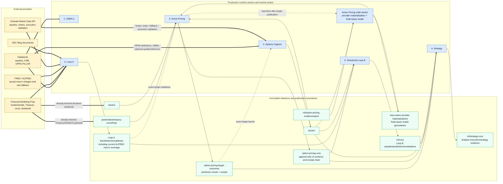

# Ducketz Loops System Map

Audited baseline commit: `3fdeca189feffb1d8167f67845503fe7cfb183e1`

OPRA-first implementation update: 2026-08-14

The owner numbering is unchanged. “Loop 3” and “Loop 4” mean the logical
Active Pricing and Options Capture owners below; the local Pricing worker is a
child of Active Pricing, not another independent owner.

The authoritative production option universe is exactly `AAPL, AMZN, GOOG,
MU, NVDA, SNDK`. CALL and PUT are derived for each symbol, yielding 12 required
routes. `SPY` is a separately declared research benchmark and cannot enter Loop
A, Loop B, Strategy, readiness, or a production route count.

Provider precedence for fair-value evidence is `databento-opra`, then explicit
causal `schwab` fallback. Schwab remains the broker-enrichment, disagreement,
execution, and fill-validation lane. Offline OPRA imports are permanently
research-only and cannot increment prospective counts.

All arrows represent persisted, receipt-verified data. Ordinary publication is
atomic and monotonic. A generation is invisible before its verified first
availability, after expiry, on quality failure, or when its checksum/receipt
cannot be verified.
