# Ducketz Loops System Map

Audited commit: `3fdeca189feffb1d8167f67845503fe7cfb183e1`

```mermaid
flowchart LR
  subgraph Providers["External providers"]
    DB["Databento Historical API<br/>metadata.get_dataset_range<br/>timeseries.get_range"]
    FMP["Financial Modeling Prep<br/>stable corporate, macro, commodity, filing search routes"]
    FRED["FRED CSV<br/>GDP · CPIAUCSL · UNRATE · FEDFUNDS"]
    SCH["Schwab Market Data API<br/>quotes · pricehistory · chains"]
    SEC["SEC filing document URLs<br/>returned by FMP metadata"]
  end

  subgraph Owners["Production runtime owners and owned worker"]
    CME["1. CME/L2<br/>continuous 5s / 15s / 60s schema cadences"]
    A["2. Loop A<br/>15-minute boundary + 20s"]
    P["3. Active Pricing<br/>15-minute +1"]
    W["Pricing child worker<br/>Schwab materialization + local shadow-model training"]
    O["4. Options Capture<br/>15-minute +6"]
    B["5. Directional Loop B<br/>15-minute +5"]
    S["6. Strategy<br/>15-minute +10"]
  end

  subgraph Store["Persisted datastore / artifact boundaries"]
    CH["CME event partitions + cursors<br/>current L2 snapshot/pointer"]
    CF["pools/cme/features/cross-asset-context/databento/1h.parquet"]
    AD["Loop A normalized bars/quotes<br/>technicals · fundamentals · signals<br/>macro · rates · energy · SEC events"]
    AR["loop-a/bar-readiness/&lt;target_ns&gt;<br/>manifest + receipt + latest pointer"]
    AC[".ducketz-loop-a-complete.json"]
    PT["option-pricing-target-outcomes<br/>outcome + predictions + receipt + pointer"]
    PW["loop-native materializations/models<br/>worker status"]
    PR["option-pricing-runs<br/>pricing surfaces/predictions + receipt<br/>option-pricing-latest pointer"]
    OP["options/pending-captures/schwab<br/>checksum-sealed pending authority"]
    OS["stocks/&lt;SYMBOL&gt;/options/snapshots/schwab<br/>chain + option-quality + receipt + pointer"]
    BR["ml/runs/&lt;timestamp&gt;<br/>samples · predictions · evaluations<br/>monitoring · intelligence · ml/latest pointer"]
    SR["ml/strategy-runs/&lt;timestamp&gt;<br/>candidates · audit · reports<br/>receipt · strategy-latest pointer"]
  end

  DB == "CME schemas and records" ==> CME
  DB == "equity OHLCV schemas" ==> A
  FMP == "corporate, macro, commodity, filing metadata" ==> A
  FRED == "GDP/CPI/unemployment/FEDFUNDS observations" ==> A
  SCH == "stock quotes and price history" ==> A
  SCH == "option chains" ==> O
  SEC == "filing document text" ==> A

  CME -->|"partitioned events, cursors, L2 snapshot"| CH
  CME -->|"derived hourly cross-asset features"| CF
  A -->|"normalized provider data and calculated features"| AD
  A -->|"exact one-minute bar readiness manifest/receipt"| AR
  A -->|"completed cycle authority"| AC
  P -->|"target-causal valuations"| PT
  P -. "launch after fast target publication" .-> W
  AD -->|"point-in-time FEDFUNDS observations"| W
  OS -->|"committed chain history"| W
  W -->|"causal residual samples, model generation, status"| PW
  PW -->|"prior local shadow model/materialization"| P
  P -->|"full pricing generations and compact surfaces"| PR
  O -->|"unready raw responses"| OP
  OP -->|"reconcile when exact readiness arrives"| O
  O -->|"immutable chain and option-quality snapshot"| OS
  B -->|"directional run and atomic current pointer"| BR
  S -->|"ranked candidates, audit, reports, receipt"| SR

  AR -. "exact-target readiness contract" .-> P
  AR -. "commit-versus-pending readiness contract" .-> O
  AC -. "complete-cycle barrier" .-> B
  PT -. "exact-target pricing barrier" .-> O

  AD -->|"completed bars + point-in-time rates"| P
  AD -->|"daily bars for realized volatility"| O
  AD -->|"bars, technicals, fundamentals, signals, quote, macro, energy, SEC"| B
  AD -->|"underlying stock BBO quote-liquidity"| S
  CF -->|"cme__ cross-asset features"| B
  OS -->|"lagged IV, contracts, reconciliation samples"| P
  OS -->|"opt__ option-quality features"| B
  OS -->|"entry/exit chains and observed BBO outcomes"| S
  PR -->|"opx__ compact pricing surfaces"| B
  PT -->|"receipt-proven target pricing predictions"| S
  PR -->|"receipt-proven pricing predictions/surfaces"| S
  PW -->|"offline replay reader; current empty-materialization load fails"| S
  BR -->|"published samples, directional probabilities, receipt"| S

  classDef provider fill:#fff3cd,stroke:#9a7500,color:#1f1f1f;
  classDef owner fill:#dbeafe,stroke:#2563eb,color:#111827;
  classDef artifact fill:#ecfdf5,stroke:#059669,color:#111827;
  class DB,FMP,FRED,SCH,SEC provider;
  class CME,A,P,W,O,B,S owner;
  class CH,CF,AD,AR,AC,PT,PW,PR,OP,OS,BR,SR artifact;
```

Legend: thick arrows are independent external-provider ingestion; solid arrows are persisted data/publication flows; dotted arrows are readiness or coordination dependencies. Cadence labels describe schedule only.
