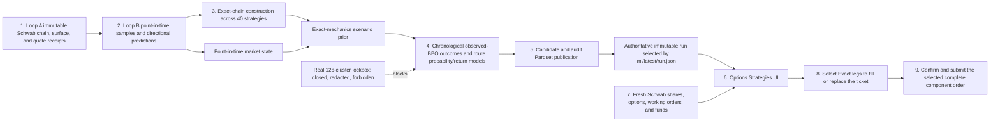

# Duckets two-loop data and ML architecture

Implementation snapshot: 2026-08-01

Duckets runs two independent supervisors against one datastore. Loop A fetches
provider data and writes both current-state and point-in-time calculated
Parquets. Loop B reads those Parquets through a closed feature profile, applies
each family's availability and freshness rules, and writes ML artifacts.
Neither loop launches or controls the other. A crash-released operating-system
lock serializes complete Loop A write cycles with complete Loop B
read/model/publication cycles.

## Topology

| Loop | Reads | Work | Writes |
| --- | --- | --- | --- |
| Loop A | provider APIs and existing canonical datasets | continuation fetch, raw storage, normalization, fundamentals, technicals, signals, feature values | symbol and shared-pool Parquets |
| Loop B | Loop A bars, closed-profile feature families, and immutable Schwab exact-chain/surface/stock-quote receipts | point-in-time samples, directional targets/models/predictions, market-state inference, exact-chain scenario priors, causal strategy outcomes, nonlinear strategy probability/return models and ranking, evaluation and monitoring | immutable seven-Parquet ML runs, authoritative current-run pointer, compatibility mirrors, directional and strategy models |
| Rolling Forecasts UI | authoritative current-run pointer and rolling intelligence artifact | schema validation and read-only directional presentation | no datastore or broker writes |
| Options Strategies UI | authoritative strategy candidates plus a fresh Schwab account snapshot | display-time position fit, exact-leg ticket drafting, human confirmation | no datastore writes; the selected confirmed component may be submitted to Schwab |

## End-to-end strategy flow



The authoritative pointer is the boundary between an immutable completed Loop
B generation and UI consumption. Compatibility mirrors do not move that
boundary. The Schwab account join and ticket exist after it; neither is written
back into model history.

Loop A remains useful on its own. Loop B can stop and restart without
interrupting data fetching or calculations. Likewise, Loop A can refresh files
while Loop B is not running. When both are active, neither can enter its
datastore cycle while the other holds the shared cycle lock, so Loop B cannot
observe a mixture of adjacent Loop A cycles. Strict technical loaders still
enforce version, timing, adjustment, completion, availability, and freshness
contracts.

## Loop A

Command:

```powershell
python -m datafetching.orchestrate `
  --datastore C:\data\duckets `
  --symbols NVDA GOOG MU `
  --providers databento fmp fred schwab sec `
  --interval-minutes 15
```

The checked-in `docs/datafetch-ml/current_start_command` is the corresponding
replacement recurring command. The default watchlist is
`datafetching/watchlist.txt`; `--symbols` replaces it. The default provider
order is `databento`, `fmp`, `fred`, `schwab`, `sec`; an explicitly supplied
provider list keeps its supplied order. The accepted profiles `auto`,
`continuation`, `full`, and `incremental` are compatibility names for the same
continuation behavior.

### Per-cycle order

Before touching provider or calculated Parquets, Loop A acquires
`.duckets-loop-a-cycle.lock` and atomically writes
`.duckets-loop-a-cycle.json` with `WRITING` status. It then runs one ordinary
full cycle. A zero-failure cycle atomically publishes `COMPLETE`; a recorded
failure or interruption publishes `FAILED`. The OS releases the lock if the
process exits unexpectedly. There is no bootstrap path, forecast fast path,
readiness lease, horizon contract, or Loop B acknowledgement in this state.

Symbols run sequentially through the full cycle. For each symbol, Loop A:

1. Runs the selected provider lanes in their configured order. In the default
   order these are Databento, FMP, FRED, Schwab, then SEC.
2. Runs fundamentals when FMP is selected and fundamentals were not skipped.
   This writes both legacy `fundamental-direction` and the newer immutable
   `point-in-time` fundamental family.
3. Runs technicals unless skipped: market regime, session-aware breakout
   pressure, Databento bar shape, and Databento weekly context where the input
   policy accepts the provider/timeframe.
4. Runs signals unless skipped. This writes a legacy
   `fundamental-technical-lifecycle` family and a separate immutable
   `technical-lifecycle` family.

Only the first symbol attempts the shared lanes: FRED; the FMP
macro/commodity-proxy fetch and energy-context materialization; and, unless
`--skip-cme` is set, the Databento CME fetch and cross-asset context
materialization. Those attempts still depend on their corresponding provider
being selected. Later symbols omit FRED but run the other selected
symbol-specific providers.

Databento's live native bar requests are `1s`, `1m`, `1h`, and `1d`. Loop A
derives `5m`, `10m`, `15m`, `30m`, and a continuity-fallback `1h` from complete
`1m` constituents without crossing session boundaries. Native `1h` rows win
duplicate timestamps; the derived hour fills only a provider-publication lag.
Every derived interval requires its full one-minute constituent count.

Loop B's `4h` route reuses the canonical completed `1h` source and its
`(symbol, "1h")` cache entry. That source prefers native Databento evidence and
uses the complete one-minute-derived hour only during native publication lag.
Loop A does not request, derive, or persist a synthetic `4h` bar.

Schwab runs quote, price-history, and option-chain work in that order. Its
option `snapshot_for` clock comes from the latest completed normalized
Databento `1m` bar ending on an exact wall-clock quarter hour. Option quality is
therefore evaluated before the current cycle's technical stage; realized
volatility evidence can come from an already persisted market-regime file, not
from technical output that will be calculated later in the same cycle.

After each continuous-mode cycle, Loop A computes the next UTC wall-clock
interval boundary, sleeps until that boundary, and then waits **20 additional
seconds** before starting the next cycle. The default interval is 15 minutes.

### Current Loop A calculated families

The versions below are persisted calculation versions, not model feature-set
versions.

| Family | Calculation version | Persistence and availability boundary |
| --- | --- | --- |
| `fundamental-direction` | `1.0.0` | Legacy current-state quarterly/annual files; `effective_from` can fall back to period end plus 90 days |
| `point-in-time` fundamentals | `1.0.0` | Immutable revision rows keyed by period and `available_at`; the live call does not supply period market-cap evidence, so market-cap-denominator features remain null |
| `market-regime` | `1.2.0` | Atomically replaced current technical history; downstream availability is reconstructed from completed bar timing |
| session-aware `breakout-pressure` | `1.1.0` | Atomically replaced current technical history; downstream availability is reconstructed from completed bar timing |
| `bar-shape` | `1.0.0` | Databento `1h`/`1d`; explicit causal availability |
| `weekly-context` | `1.0.0` | Databento daily input to completed exchange weeks; explicit causal availability |
| `fundamental-technical-lifecycle` | `1.0.0` | Legacy current-state signal built from legacy `fundamental-direction`, not from the new PIT fundamental family |
| `technical-lifecycle` | `1.0.0` | Immutable canonical Databento-daily lifecycle snapshot |
| Schwab `quote-liquidity` | `1.0.0` | Immutable receipt-time observations; invalid quotes and live-session staleness fail, while closed-session stale receipts persist with failed quality and cannot replace the latest eligible session evidence |
| Schwab `option-quality` | `1.2.0` | Immutable option-surface snapshots; option-chain schema is `1.1.0` |
| FMP `energy-context` | `1.0.0` | Immutable direct-WTI/proxy-chain observations |
| Databento `cross-asset-context` | `1.0.0` | Immutable synchronized 60-minute cross-asset windows; a status-only closed schema preserves complete OHLCV return context while unavailable microstructure fields remain missing |
| SEC events | `1.0.0` | Immutable filing-extraction events using `capital-structure-rules-v1` |

The live FRED lane persists current-revised GDP, CPI, unemployment, and federal
funds histories. `datafetching/fred_vintages.py` implements a true
release/vintage path, but Loop A does not call it, so the current FRED ingestion
must not be described as vintage-safe macro history.

### Loop A storage boundary

Representative outputs:

```text
DATASTORE/stocks/NVDA/bars/1h/databento/normalized/*.parquet
DATASTORE/stocks/NVDA/fundamentals/fundamental-direction/fmp/quarterly.parquet
DATASTORE/stocks/NVDA/fundamentals/point-in-time/fmp/quarterly.parquet
DATASTORE/stocks/NVDA/technicals/market-regime/databento/1h.parquet
DATASTORE/stocks/NVDA/technicals/breakout-pressure/databento/1h.parquet
DATASTORE/stocks/NVDA/technicals/bar-shape/databento/1h.parquet
DATASTORE/stocks/NVDA/technicals/weekly-context/databento/1w.parquet
DATASTORE/stocks/NVDA/signals/fundamental-technical-lifecycle/consensus/daily.parquet
DATASTORE/stocks/NVDA/signals/technical-lifecycle/consensus/daily.parquet
DATASTORE/stocks/NVDA/quotes/features/quote-liquidity/schwab/*.parquet
DATASTORE/stocks/NVDA/options/chains/schwab/raw/*.parquet
DATASTORE/stocks/NVDA/options/chains/schwab/normalized/*.parquet
DATASTORE/stocks/NVDA/options/features/option-quality/schwab/*.parquet
DATASTORE/stocks/NVDA/corporate/sec-events/sec/*.parquet
DATASTORE/pools/macro/features/energy-context/fmp/quote.parquet
DATASTORE/pools/cme/features/cross-asset-context/databento/1h.parquet
```

Normalized bars have the strict leading schema
`id,timestamp,open,high,low,close,volume`; provider-specific bar fields stay in
raw storage. Normalized bar files contain completed intervals only and use
overlap refetch plus timestamp upsert for continuation.

Every persisted Parquet has exactly one readable Duckets-generated `id`.
Natural timestamp and availability columns provide the Loop B join surface.
Individual `ParquetStore` writes use a temporary file and atomic replacement.
That does not mean every file is an immutable event log:

- provider raw artifacts may be latest snapshots or lane-specific append/upsert
  histories;
- normalized canonical files are stable files updated by snapshot, upsert, or
  append-if-changed/revised policies;
- legacy fundamental, technical, and legacy lifecycle outputs are atomically
  replaced current histories;
- PIT fundamentals, quote liquidity, option surfaces, energy context, CME
  context, SEC events, and technical lifecycle append immutable natural-key
  rows and fail closed on conflicting same-key content.

There is no atomic commit spanning all files in a Loop A cycle.

## Loop B

Command:

```powershell
python -m ml.prediction_runtime `
  --datastore C:\data\duckets `
  --symbols NVDA GOOG MU `
  --provider databento `
  --feature-profile loop-a-all-v1 `
  --horizons 1h 4h 1d 1w `
  --interval-minutes 60 `
  --phase-offset-minutes 5
```

At each configured phase, Loop B acquires the shared datastore cycle lock and
requires the latest Loop A cycle state to be `COMPLETE`. It holds the lock until
the complete model run and atomic publication finish. The completed cycle's
existing `finished_at` bounds eligible Loop A receipts, while Loop B records its
own run, prediction, evaluation, and publication times from its actual runtime
clock. Phase zero is allowed; point-in-time actionability rules decide which
source decisions are eligible.

### Per-cycle order

1. Resolve symbols, selected horizons, and the closed versioned feature profile.
   The default is `loop-a-all-v1`; `production-v1` and `technical-all-v2`
   retain the older technical-only profiles.
2. Load adjusted normalized bars, market-regime values, and breakout-pressure
   values for each route; reject the route if either technical file's
   `price_adjustment_status` or `split_event_count` differs from the current
   adjusted bars.
3. Validate the explicit registry and assemble the horizon-applicable
   `loop-a-all-v1` families. In addition to technical values, this includes bar
   shape, weekly context, both lifecycle families, legacy fundamental direction,
   PIT fundamentals, Schwab quote/option evidence, FMP energy context,
   current-revised FRED macro context, SEC events, and CME context.
4. Build `1h`, `4h`, and `1d` targets plus aggregate `1w` and component
   `1w-d1` through `1w-d5` target windows and labels. Native `1h`
   remains the intraday decision-feature source. The calendar first fixes the
   next eligible session-segment or full local-clock anchor strictly after
   information availability, then fixes exactly 60 or 240 eligible regular
   one-minute constituents from adjusted native `1m` target data. Each weekly
   route uses the existing 132-column `1w` feature inventory. Aggregate `1w`
   targets Day 1 official open through the final eligible close of Day 1's
   exchange week; the five components target each eligible session's official
   open-to-close direction.
5. Exclude verified prior-LIVE target starts from offline partitioning, then
   split the remaining completed targets chronologically by distinct
   `target_window_start` cluster into training, calibration, assessment, and a
   latest closed lockbox.
6. Purge actual target-window overlap across training-to-calibration,
   calibration-to-assessment, and assessment-to-lockbox boundaries. This
   purges overlapping rolling remaining-week aggregate windows as well as `4h`
   windows. Never coerce, read, return, predict, or score lockbox targets.
7. Reuse a compatible model or train and calibrate a new model. Under the
   default logistic/Platt configuration, aggregate `1w` uses the route-specific
   estimator and calibrator policy described below.
8. Generate assessment predictions and currently actionable fresh non-weekly
   predictions. If entry has passed, carry at most one receipt-proven ordinary
   forecast per route only while its exact current target window is in progress;
   preserve its original issuance, mark it non-actionable, and let a newer valid
   current-run forecast supersede it. For public `1w`, use the latest completed daily decision to
   issue aggregate `1w` plus the contiguous Day 1 prefix remaining in one
   exchange week. Reuse the exact verified rows for the same decision; replace
   them when a newer completed decision produces a shorter outlook.
9. Remove every directional closed-lockbox cluster from the publishable sample
   view and pass the removed `target_window_start` values to strategy analytics
   as a forbidden set. A reappearing start is a hard failure.
10. Run `schwab-spreads-v1`: load immutable normalized Schwab contracts,
    matching option-quality surfaces, and stock BBO receipts. Combine the
    separate directional probability, when causally available, with surface and
    audited context under `point-in-time-market-state-v1`; use neutral sign
    weights when historical assembly has no matching forecast; build exact legs
    from the 40-strategy registry; score every candidate with
    `greek-bbo-scenario-prior-v1`; and
    create causal historical outcomes from future observed bid/ask receipts and
    modeled option fees. No theoretical option price substitutes for a missing
    receipt or historical label.
11. For each concrete route, keep every candidate from one target start in one
    chronological cluster. On at least 252 training clusters, fit or reuse the
    nonlinear profitable-outcome classifier and expected-return-residual
    regressor; fit weighted Platt calibration for the classifier on the next 63;
    and reserve the next 63 for assessment. Assessment and the real lockbox
    affect neither estimator fit nor calibration.
12. Match current exact-chain candidates to the canonical LIVE directional
    prediction. Publish fitted probability/expected-return/market-rank fields
    when a compatible model exists. Otherwise publish raw scenario probability,
    expected return, score, and rank as `MARKET_STATE_PRIOR`, leaving only the
    calibrated probability null. Build one audit row per attempted route and
    each of the 40 registry strategies.
13. Persist `samples.parquet` without closed-lockbox rows, then persist
    `predictions.parquet`.
14. Join predictions to matured sample targets by readable natural columns,
    then require matching target-definition version/serialized specification,
    exact target windows, round-trip cost, and valid prospective timing. Record
    an explicit mismatch/pending/invalid status instead of scoring an
    incompatible row.
15. Calculate log loss, Brier score, observed return, and threshold correctness
    only for `EVALUATED` rows, then persist `evaluations.parquet`.
16. Calculate global coverage and model-reuse values, plus evaluated performance
    at global and per-horizon scopes. Calculate pooled `live_horizon`
    performance when matured LIVE predictions exist, and separately count
    unique completed LIVE forecasts for each symbol/horizon route. Persist
    `monitoring.parquet`.
17. Build and persist one `intelligence.parquet` row per symbol and horizon,
    deriving its live-evidence status from the horizon threshold independently
    of actionability or verified in-progress probability visibility.
18. Add readable natural `id` values, enforce the explicit Arrow schemas, and
    persist `strategy-candidates.parquet` and `strategy-audit.parquet`. Empty
    results still use the exact schemas.
19. Write the manifest with all seven Parquets, exact input inventories,
    strategy model reports, and the versioned NYU/HU/UH research trace.
20. Prepare compatibility mirrors, durably write and verify
    `publication.json`, and atomically commit the authoritative
    `ml/latest/run.json` pointer.

Loop B uses the real scoring clock for fresh `prediction_created_at`, checks it
against each corresponding target start, and checks the real publication clock
again before committing the current pointer. A carried ordinary row is checked
against its strict target-window end separately from fresh entry deadlines.
Equality fails closed. A missing,
malformed, stale, or otherwise invalid route leaves the prior authoritative
pointer unchanged; the next scheduled Loop B cycle tries the latest complete
Loop A state again. A repeated non-weekly run may legitimately publish the same
source decision with a new prediction event when no newer market data exists.
An issued weekly bundle is different: later cycles retain its exact
probabilities, model versions, prediction timestamp, and target windows while
refreshing only outcome and evidence status.

The aggregate `1w` estimator override applies only when the requested family is
logistic: L1 regularization, `C=0.3`, `liblinear`, `max_iter=5000`, and
`tol=1e-5`. When aggregate `1w` also requests Platt calibration, its calibrator
uses `C=0.1` and stores the chronological calibration partition's minimum and
maximum raw probabilities. Later raw probabilities are clipped to that support
before the Platt mapping. The `1w-d1` through `1w-d5` models keep the ordinary
logistic and calibration parameters. Estimator parameters and the conditional
aggregate calibration parameters participate in manifest compatibility, so an
older aggregate artifact cannot be silently reused under this policy.

The `1h` and `4h` selections occur before price lookup. A break, overnight
closure, weekend, holiday, early close, or session boundary does not count
toward the required 60 or 240 eligible minutes, so elapsed wall-clock time can
exceed the nominal horizon and the first-minute-open-to-final-minute-close
return includes intervening price gaps. If any predetermined native-minute
constituent is missing, the window is not shifted; its label remains incomplete.

The live-evidence thresholds are `1h=60`, `4h=60`, `1d=30`, and 30 for each
of `1w`, `1w-d1`, `1w-d2`, `1w-d3`, `1w-d4`, and `1w-d5`. Offline
assessment rows support global and horizon performance monitoring but do not
satisfy these live thresholds. Pooled `live_horizon` rows summarize model
performance only; they are not a route's evidence count. Meeting a threshold
never enables automated action. A completed LIVE forecast must be prospective,
matured, contract/window/cost-compatible, and recovered from a complete
verified run; runs declaring the transactional publication contract also
require a valid manifest-bound `publication.json` receipt and reachability
through the authoritative pointer's publication chain.

Feature assembly uses readable natural columns and family-specific
`available_at`, `effective_from`, completed-bar, receipt, publication, or filing
timestamps. It does not construct an opaque observation/publication/lineage ID
chain. Legacy families retain their weaker historical availability semantics;
including them in `loop-a-all-v1` does not turn them into PIT artifacts.

### Loop B run storage

```text
DATASTORE/ml/
├── runs/
│   └── 20260729T184512.123456Z/
│       ├── samples.parquet
│       ├── predictions.parquet
│       ├── evaluations.parquet
│       ├── monitoring.parquet
│       ├── intelligence.parquet
│       ├── strategy-candidates.parquet
│       ├── strategy-audit.parquet
│       ├── manifest.json
│       └── publication.json
├── latest/
│   ├── samples.parquet
│   ├── predictions.parquet
│   ├── evaluations.parquet
│   ├── monitoring.parquet
│   ├── intelligence.parquet
│   ├── strategy-candidates.parquet
│   ├── strategy-audit.parquet
│   └── run.json
├── models/
│   └── <horizon>/<model-name>/<trained UTC timestamp>/
│       ├── model.joblib
│       └── manifest.json
└── strategy-models/
    └── <horizon>/market-state-strategy-outcome/<trained UTC timestamp>/
        ├── model.joblib
        └── manifest.json
```

Each directional model-name directory and each
`market-state-strategy-outcome` directory also has a readable `latest.json` path
pointer.

Timestamp directories are operational history, not content addresses. Run
manifests record readable paths, configuration, feature columns, target column,
and output integrity metadata. Model manifests additionally record configured
model parameters, the aggregate-only calibration parameters when applicable,
and offline calibration-support evidence. A successful publication has
`publication.json`, bound to
the manifest checksum and linked to the preceding committed receipt-era
publication, if any.
Working or failed pre-commit runs are not reachable through that chain even if
they reached a complete manifest or an orphaned prepared receipt. Checksums
verify bytes only; they are never directory names, row values, or join keys.

`ml/latest/run.json` is the single authoritative current-view commit pointer.
Official readers resolve immutable run artifacts through it. The predictable
Parquets under `ml/latest` are compatibility/convenience mirrors and are not
the publication commit signal.

### Current UI file

Loop B maintains a compatibility mirror of the completed intelligence output
at:

```text
DATASTORE/ml-intelligence/latest/rolling-predictions.parquet
```

By default the desktop UI follows authoritative `ml/latest/run.json` and reads
the immutable run's `intelligence.parquet`. The explicit path above remains
available as a compatibility mirror and as the legacy fallback when no pointer
exists; it is not publication authority for receipt-era runs.

The Rolling Forecasts route order remains `1h`, `4h`, `1d`, `1w`, but `1w`
renders one **remaining-week outlook** from the current aggregate and Day 1
prefix. A complete successful three-symbol all-horizon publication still
contains 27 current-output model-route rows and renders three ordinary cards
plus one grouped weekly outlook per symbol. Unused later weekly routes carry no
current probability. That is the publication contract, not evidence that such
a live run has already occurred. Deployment and supervisor restart remain
explicit operator actions.

The sibling Options Strategies tab starts from the predictable path:

```text
DATASTORE/ml/latest/strategy-candidates.parquet
```

When `ml/latest/run.json` exists, the reader does not consume that mirror
directly. It resolves and verifies the pointer/receipt/manifest chain and opens
`strategy-candidates.parquet` inside the selected immutable run. It then calls
`sync_schwab_portfolio()` and calculates
`current-schwab-position-fit-v1` from applicable shares, option-position count,
working option-order count, and available funds. The persisted market score and
live position adjustment remain separate; their sum is the displayed overall
score. **Market probability** is calibrated strategy probability for fitted
rows and the explicitly uncalibrated raw scenario prior for
`MARKET_STATE_PRIOR` rows; neither is the Rolling Forecasts directional
probability.

Selecting **Exact legs** fills or replaces a
`schwab-strategy-order-draft-v1` ticket. Most candidates map to one complete
Schwab order. Twin-Peak Fly exposes separate lower-price and higher-price 1:2:1
butterflies; Range-to-Trend Relay exposes a near-expiration iron condor and a
later-expiration long strangle. The operator selects the component, strategy
quantity, human-readable order method, limit price where applicable, and
duration. After confirmation, **Submit Order** calls the existing
`SchwabSession().submit_order(...)`; a successful component advances to the
next one. The UI never invents a five- or six-leg atomic request and never
writes account state or ticket state back to the ML publication.

## Failure isolation

Loop A isolates provider lanes and, within most lanes, individual requests. A
provider exception is persisted as an orchestration error and converted into a
failed fetch result, so later providers and calculation stages can continue. A
failed lane does not erase current canonical files from other lanes.

Databento retries classified rate-limit/server failures for up to 75 attempts
with four seconds between attempts. Schwab retries price-history requests for up
to 60 attempts with five seconds between attempts. Schwab quote and option
requests, FMP, FRED, and SEC do not have equivalent lane-wide retry loops.
`Ctrl+C` is not swallowed by either retry helper.

The cycle failure count includes provider-reported errors and one failure for
each fundamentals, technicals, or signals stage that returns nonzero. This is
not complete visibility into every partial calculation failure:

- fundamentals returns success when at least one requested period produced
  output, even if another period failed;
- signals returns success when either the legacy lifecycle or technical
  lifecycle produced output, even if the other family failed;
- an unexpected exception outside the provider wrapper or a calculation's own
  error handling can still abort the supervisor.

With `--once`, Loop A returns nonzero when the recorded cycle count is nonzero.
Continuous Loop A logs recorded cycle failures and proceeds to the next
scheduled cycle.

Loop B is fail-closed at the publication boundary. It records materialization
status per route internally, but any required route that is not `READY` aborts
the cycle before a run directory is created. Any model or prediction error
also aborts the cycle, even when a BACKTEST row could otherwise be computed.
A horizon's prediction frames are committed to the run only after that
horizon completes successfully. Loop B never publishes partial-route or
failure rows to `ml/latest` or the UI.

A later failure can leave an unpromoted timestamped working directory. It may
have no completed manifest, or a completed manifest but no valid
`publication.json` receipt. Either form is skipped by prior-run discovery. The
authoritative `ml/latest/run.json` pointer continues to expose the previous
successful publication; compatibility mirrors are not consulted to infer a
new current run. With `--once`, the failed Loop B cycle returns nonzero.

Within the always-running strategy stage, missing Schwab chain history, no
eligible current receipt, unavailable causal exits, insufficient chronological
model evidence, and per-route construction failures are represented as audit
or model-report states. They can produce an exact empty candidate schema,
40 failed audit rows for an attempted route, or prior-ranked candidate rows without
weakening the directional publication. A malformed strategy schema, an
unexpected strategy-stage exception, or any forbidden real-lockbox start is
not a degradation case and aborts the publication.

Both supervisors:

- create their own lock file before the first cycle;
- reject a second instance of the same supervisor using that datastore, while
  their distinct lock paths allow Loop A and Loop B to run together;
- handle `Ctrl+C` and remove the lock in a `finally` block.

For cross-loop consistency they also acquire the same crash-released OS cycle
lock. Loop A writes `WRITING` after acquisition and `COMPLETE` or `FAILED`
before release. Loop B reads only `COMPLETE` state while holding that lock.
These values live in a small JSON state file and are not Parquet columns.

Loop A calculates the next UTC interval boundary in continuous mode, sleeps to
it, and applies its additional 20-second post-boundary delay. Loop B schedules
the next recurring run at its configured UTC phase (`+05` in the replacement
command). If the other loop is active, the arriving loop waits for the OS cycle
lock. If Loop A's last cycle is incomplete or failed, Loop B fails that attempt
without publication and tries again on its next normal schedule.

The checked-in commands are deployment instructions only. An operator still
must deploy the code and restart/activate both supervisors together; editing
the repository does not alter either running service.

## Parquet ID boundary

The repository-wide invariant is:

```text
one Parquet → one Duckets-generated column named id
```

The value is readable and uses the minimum natural row key. Examples:

```text
bar:         2026-07-29T18:00:00Z
sample:      NVDA|1d|2026-07-29T20:05:00Z
prediction:  NVDA|1d|2026-07-29T20:05:00Z|2026-07-29T21:00:00Z
monitoring:  mean_log_loss|global|all|2026-07-29T21:00:00Z
strategy:    GOOG|1d|2026-08-01T15:00:00Z|long_call\|w1\|front=2026-09-18\|back=none
```

Joins use `id` when two files share the same exact row grain, or the readable
natural columns such as `symbol`, `horizon`, and `decision_timestamp` when their
grains differ.

Strategy candidates use
`symbol, horizon, decision_timestamp, candidate_key`; strategy audits use
`symbol, horizon, decision_timestamp, strategy_name`. `legs_json` retains the
complete exact provider leg graph but is not a second identity column. Both
strategy writers enforce their explicit Arrow schemas and reject extra or
opaque identity-shaped fields.

Databento `instrument_id` and `publisher_id` are allowed only in raw provider
data. They are never Duckets join keys. A provider field literally named `id`
is renamed `provider_native_identifier`. FRED request configuration uses
`FredSeriesSpec.series_id`; persisted FRED Parquets still receive the one
Duckets-generated `id`, based on their readable natural row key rather than a
provider ID.

The full contract is in
[`parquet-id-contract.md`](parquet-id-contract.md).

## Implementation inventory

| Responsibility | Module |
| --- | --- |
| Loop A supervisor, lock, and schedule | `datafetching/orchestrate.py` |
| Provider fetch coordination | `datafetching/main.py` |
| Canonical raw/normalized writes | `datafetching/parquet_store.py` |
| Readable ID construction | `datafetching/ids.py` |
| Normalized bar contract | `datafetching/bar_schema.py` |
| Completed-bar timing and legacy compaction | `datafetching/bar_timing.py` |
| Databento live derived bars | `datafetching/derived_bars.py` |
| Fundamental calculations | `fundamentals/main.py` |
| FMP point-in-time fundamentals | `fundamentals/point_in_time.py` |
| Technical calculations | `technicals/main.py` |
| Quote-liquidity features | `datafetching/quote_liquidity.py` |
| Option snapshot clock and features | `datafetching/decision_time.py`, `options/snapshot.py`, `options/features.py` |
| Energy and CME shared contexts | `datafetching/fmp_energy_context.py`, `datafetching/cme_cross_asset_context.py` |
| SEC event persistence | `datafetching/sec_events.py` |
| Cross-domain signals | `signals/main.py` |
| Immutable technical lifecycle | `signals/technical_lifecycle.py` |
| Loop B supervisor, lock, and schedule | `ml/prediction_runtime.py` |
| Loop B stage coordination | `ml/runtime_pipeline.py` |
| Closed feature registry and profiles | `ml/feature_registry.py`, `ml/horizons.py` |
| Feature and target materialization | `ml/rolling_materialization.py`, `ml/rolling_samples.py` |
| Model fit and reuse | `ml/model_runtime.py` |
| Estimator construction and calibration | `ml/models/registry.py`, `ml/calibration.py` |
| Timestamped artifacts and latest copies | `ml/artifacts.py` |
| Explicit ML Parquet schemas | `ml/parquet_contracts.py` |
| Rolling forecast UI adapter | `app/ui/rolling_forecast_data.py` |
| Exact Schwab strategy receipt loading | `ml/strategy_selection/chain.py` |
| 40-strategy registry and exact-leg construction | `ml/strategy_selection/registry.py`, `ml/strategy_selection/candidates.py` |
| Point-in-time market state and scenario prior | `ml/strategy_selection/market_state.py` |
| Strategy partitions, model, calibration, and rank | `ml/strategy_selection/model.py`, `ml/strategy_selection/runtime.py` |
| Strategy research trace | `ml/strategy_selection/research_trace.py` |
| Options Strategies authoritative reader and live position fit | `app/ui/options_strategy_data.py` |
| Options Strategies screen | `app/ui/options_strategies.py` |
| Schwab strategy payload construction | `app/services/schwab_strategy_orders.py` |
| Shared Schwab confirmation and receipt text | `app/ui/schwab_order_messages.py` |
