# Independent options-strategy selection

## Status and operating boundary

`ml.strategy_runtime` owns the versioned options-strategy analytics subsystem.
The `schwab-spreads-v1` policy runs only after directional Loop B has completed
and published. It reads that exact Loop B run, checksum-verified independent
Options receipts, and stock BBO evidence. Strategy never calls Schwab, submits
an order, changes a directional-model partition, or mutates its source Loop B
directory. The Duckets Options Strategies screen combines the separately
published surface with the current Schwab account snapshot and provides the
operator-owned order ticket.

The account authorization represented by this policy is **Schwab Spreads**.
That authorization is separate from:

1. whether the exact chain contains the contracts needed to construct a strategy;
2. whether current shares, cash, buying power, working orders, and option
   positions make it eligible now;
3. whether Duckets can atomically submit and reconcile its Schwab order shape;
4. the amount and quality of route-level historical evidence currently available.

The Options Strategies execution adapter supports single-leg and complex Schwab
orders without treating execution shape as an account-approval statement. The
analytics output contains no trade/no-trade verdict. It publishes every
constructible candidate and its measurements.

### Verified policy identifiers

| Responsibility | Identifier |
| --- | --- |
| Strategy runtime policy | `schwab-spreads-v1` |
| 40-strategy registry | `schwab-spreads-strategy-registry-v1` |
| Exact-chain candidate construction | `schwab-exact-chain-candidates-v3` |
| Causal quote outcome | `observed-bbo-pseudo-outcome-v2` |
| Point-in-time market state | `point-in-time-market-state-v1` |
| Exact-mechanics scenario prior | `greek-bbo-scenario-prior-v1` |
| Chronological strategy model | `market-state-hgb-platt-return-v3` |
| Persisted market ranking | `continuous-market-state-ranking-v2` |
| Research trace | `nyu-hu-uh-trace-v2` |
| Display-time Schwab position overlay | `current-schwab-position-fit-v1` |
| UI-to-Schwab order draft | `schwab-strategy-order-draft-v1` |

The first nine identifiers belong to Strategy artifacts and manifests. The last
two belong to the UI boundary: neither current account state nor an order draft
is persisted as a historical strategy-model feature.

## Research traceability

The implementation carries a readable research trace in every Strategy
run manifest and every strategy-model manifest. The machine-readable trace is
versioned as `nyu-hu-uh-trace-v2`.

| Source | Retained insight | Implemented consequence | Explicit boundary |
|---|---|---|---|
| [NYU-FUND-ML](../edu/NYU-FUND-ML.md) | Point-in-time inputs, chronological validation, threshold analysis, data quality, transaction costs, robustness | Immutable receipts; decision-cluster train/calibration/assessment partitions; continuous rankings; published quality fields; bid/ask and fee labels | Annual cross-sectional earnings evidence does not prove GOOG options performance or intraday transferability |
| [HU-ML-OPTIONS](../edu/HU-ML-OPTIONS.md) | Compare realized option outcome with option-implied cost; chronological learning; analyze outcomes across estimated edge | Exact-chain premiums; future causal receipt labels; calibrated profitable-outcome probability; complete route rankings | Synthetic option prices, test reuse, and deficit-recovery sizing are rejected |
| [UH-OPTIONS-OVERVIEW](../edu/UH-OPTIONS-OVERVIEW.md) | Payoff algebra, Greeks, valuation drivers, parity and bounds | Declarative legs; max-loss checks; aggregate Greeks; standard-contract checks | Educational mechanics are not empirical ML evidence; its put upper-bound error is not used |

The trace distinguishes evidence from inference. The research supports the
evaluation discipline and mechanical formulation. Duckets must independently
demonstrate GOOG route-level calibration, ranking quality, executable outcomes,
lifecycle behavior, and economic value after all costs.

## End-to-end decision flow

```mermaid
flowchart LR
    A["Committed Options exact-chain and surface receipts plus stock BBO"] --> B["Point-in-time market state"]
    P["Completed authoritative Loop B directional run"] --> B
    A --> C["40-strategy exact-leg construction"]
    B --> D["Exact-mechanics scenario prior"]
    C --> D
    C --> E["Pre-lockbox causal future-BBO outcomes by target cluster"]
    D --> F["Training: probability and expected-return models"]
    E --> F
    X["Real 126-cluster lockbox: redacted and forbidden"] -.->|blocks| E
    F --> G["Calibration: weighted Platt fit on probability only"]
    E --> H["Assessment: evidence only"]
    G --> H
    D --> I["Prior score, or fitted probability and return residual"]
    H --> I
    I --> J["Continuous exact-candidate ranking"]
    J --> K["strategy-candidates.parquet and strategy-audit.parquet"]
    K --> L["Authoritative ml/strategy-latest/run.json publication boundary"]
    L --> M["Options Strategies screen"]
    N["Fresh Schwab shares, options, working orders, and funds"] --> M
    M --> O["Select Exact legs to replace the ticket"]
    O --> Q["One complete order, or one selected complete component"]
    Q --> R["Confirm and Submit Order through SchwabSession"]
```



The real directional-model lockbox is removed before Loop B publishes
`samples.parquet`; the Strategy runtime can therefore never read, label,
predict, score, or select a real lockbox row. Its manifest binds the exact
redacted sample file and source Loop B publication receipt.

## Authorized strategy registry

Registry version `schwab-spreads-strategy-registry-v1` contains all 40 named
strategies in the reviewed Schwab Spreads universe:

- Long and volatility: Long Call, Long Put, Long Straddle, Long Strangle.
- Covered and cash-secured: Covered Call, Buy-Write, Protective / Married Put,
  Collar, Cash-Secured Put, Covered Strangle / Combination, Wheel.
- Verticals: Bull Call Spread, Bear Put Spread, Bull Put Spread, Bear Call
  Spread.
- Butterflies: Long Call Butterfly, Long Put Butterfly, Short / Reverse Call
  Butterfly, Short / Reverse Put Butterfly, Iron Butterfly, Reverse Iron
  Butterfly.
- Condors: Long Call Condor, Long Put Condor, Iron Condor, Reverse Iron Condor.
- Calendars and diagonals: Long Call Calendar, Long Put Calendar, Bull Call
  Diagonal, Poor Man's Covered Call, Bear Put Diagonal, Double Diagonal.
- Ratios and defined risk: Call Ratio Backspread, Put Ratio Backspread, Stock
  Repair / Covered Ratio, Box Spread.
- Custom: Reaccelerating Bull, Phoenix Collar, Twin-Peak Fly,
  Crash-and-Squeeze Barbell, Range-to-Trend Relay.

The registry rejects an `UNLIMITED_UNCOVERED` risk form. Every short option must
belong to a declared defined-risk, covered-stock, cash-secured, or governed
multi-expiration structure. Construction is atomic at the candidate level: an
incomplete leg graph is not emitted.

The Wheel and Range-to-Trend Relay are lifecycle strategies. They are visible in
the audit and candidate registry, but the one-window labeler deliberately
returns `LIFECYCLE_PATH_REQUIRED`. They cannot be trained on a fabricated
single-close outcome. Their production evidence requires position-state,
assignment, roll, and contingent-transition receipts.

## Exact-chain candidate construction

Candidate policy `schwab-exact-chain-candidates-v3`:

- reads normalized contracts from
  `stocks/<S>/options/chains/schwab/normalized/YYYY-MM.parquet`, surface
  diagnostics from
  `stocks/<S>/options/features/option-quality/schwab/YYYY-MM.parquet`, and
  stock BBO receipts from
  `stocks/<S>/quotes/features/quote-liquidity/schwab/YYYY-MM.parquet`;
- validates option-chain schema `1.1.0`, option-quality
  calculation/schema/policy `1.2.0`, `option-surface-v2`, and
  `schwab-option-surface-quality-v1`, plus stock-quote schema/policy
  `quote-liquidity-v1` and `schwab-quote-quality-v1`;
- selects a `schwab-option-surface-quality-v1` receipt whose `snapshot_for` is
  at or after the Loop B completed bar end and no later than the causal entry cutoff;
- requires the receipt to have been available at or after the decision's
  `information_available_at` and no later than the earlier of the completed
  Loop A cycle `finished_at` or one nanosecond before target entry;
- admits standard, non-mini, 100-multiplier contracts with a finite, uncrossed
  BBO that can be used arithmetically;
- records upstream surface/quote validity, quote age, open interest, and spread
  checks on every candidate without suppressing a numerically usable row;
- reports route-specific liquidity comparisons: maximum relative spread of 10% for
  `1h`, 12% for `4h`, 20% for `1d` and `1w-d1` through `1w-d5`, and 25% for
  aggregate `1w`; minimum open interest is 25 for intraday routes and 10 for
  daily/weekly routes;
- chooses exact strikes around the chain's ATM strike at two deterministic width
  steps and up to two eligible expirations;
- requires an exact numerically usable Schwab stock BBO for every strategy
  containing stock and reports its upstream quality result;
- records the complete readable leg graph, entry prices, Greeks, liquidity,
  premium, conservative capital, risk calculation, target elapsed hours, and
  front/back calendar time to expiration.

For historical labels the entry selector uses the earliest eligible receipt;
for the current publication it uses the latest eligible receipt known at the
run timestamp. Both bind contracts to the exact
`symbol, snapshot_for, available_at` surface. `candidate_key` is the readable
variant
`<strategy>|w<width>|front=<YYYY-MM-DD>|back=<YYYY-MM-DD-or-none>`.
`legs_json` is the complete exact graph: each option leg carries the provider
contract symbol, side, quantity, option type, expiration role/date, strike,
bid, ask, 100-share multiplier, Greeks, relative spread, open interest,
volume, quote-valid/liquidity flags, quote age, and receipt time; a stock leg
carries symbol, side, quantity, BBO, multiplier, quality flag, and receipt
time. It is order-draft input and audit evidence, not a second row identity.

Same-expiration structures receive an expiration-payoff max-loss calculation.
Multi-expiration structures receive a conservative assignment-notional capital
bound because their true risk depends on the path, front-leg assignment, and
remaining back-leg value. A theoretical price is never substituted for an
observed Schwab fill or outcome.

## Causal outcome labels

Outcome policy `observed-bbo-pseudo-outcome-v2` uses:

- long option entry at ask and exit at bid;
- short option entry at bid and exit at ask;
- long stock entry at ask and exit at bid;
- the model's fixed $0.65 fee per option contract on both entry and exit;
- the earliest passing future receipt after the target window, within the
  route-specific exit tolerance;
- exact contract-symbol continuity for every leg.

The maximum exit-receipt delays are two hours for `1h`, six hours for `4h`,
two days for `1d` and `1w-d1` through `1w-d5`, and four days for aggregate
`1w`. Both `snapshot_for` and `available_at` must be at or after the fixed
target end. The upper bound is also capped one nanosecond before the earliest
real-lockbox start for that route.

Missing future contracts, missing stock BBOs, non-numeric BBOs, and missing exit
receipts are recorded as unavailable observations. They are not silently replaced with
theoretical values or imputed into labels. Only `outcome_status=COMPLETE` rows
enter model partitions. The target is strict positive net profit after the
observed bid/ask quotes and modeled fees. These are executable-quote
pseudo-outcomes, not claims of actual fills. Applying every leg at its adverse
side of the BBO is conservative for spread crossing, but it does not reproduce
combo-order price improvement, partial fills, assignment, or a broker statement.

[Schwab's current pricing guide](https://www.schwab.com/legal/schwab-pricing-guide-for-individual-investors)
also describes a buy-to-close waiver for qualifying contracts priced at $0.05
or less and notes that other fees can apply. The pseudo-outcome policy does not
claim that waiver and does not model variable exchange or regulatory fees.
Those costs require account-statement reconciliation before deployment evidence
can support action.

## Training, calibration, and assessment

Model policy `market-state-hgb-platt-return-v3` is route-specific. Every exact
candidate from one `target_window_start` remains in the same partition.
Target-window overlap is purged at both chronological boundaries.

- Training is expanding and requires at least 252 pre-lockbox decision clusters.
- The next 63 decision clusters fit Platt calibration.
- The latest 63 pre-lockbox decision clusters are assessment evidence only.
- Assessment outcomes influence neither fitting nor calibration.
- Candidate rows receive inverse decision-count weights during fitting,
  calibration, and primary assessment metrics so a decision with more
  constructible variants does not dominate evidence.
- Numeric preprocessing uses training-only median imputation, 0.25th/99.75th
  percentile clipping, robust scaling, and missing indicators.
- Strategy and structure fields use an unknown-safe categorical encoding.

The fitted system has two nonlinear histogram-gradient-boosting estimators. A
classifier learns candidate profitable-outcome probability. A regressor learns
the observed return-on-risk residual relative to the causal scenario prior;
adding that residual back to the prior yields fitted expected return. Both use
learning rate `0.05`, 200 boosting iterations, at most 31 leaves, L2
regularization `1.0`, disabled internal early stopping, and the fixed policy
random state. Disabling the estimator's implicit validation split keeps all
preprocessing and estimator work inside the explicit training partition. When
calibration contains both classes, the weighted Platt calibrator stores the calibration
slice's observed raw-probability range and clips later raw probabilities to that
support before mapping them. A one-class calibration slice uses the identity
calibrator and records effective method `none`. Platt calibration applies only
to the probability model; neither calibration nor assessment outcomes fit the
expected-return model.

Before enough complete outcomes exist to fit those estimators,
`greek-bbo-scenario-prior-v1` supplies a causal score for every constructible
candidate. It evaluates 129 deterministic half-normal move magnitudes in each
direction, weights the signs by the separate directional probability, and uses
the candidate's aggregate delta, gamma, theta, holding time, exact BBO spread,
modeled entry-and-exit option fees, and exact profit/loss bounds. This is a
mechanics-based prior, not an empirically calibrated GOOG probability. It gives
the UI useful, finite values while preserving the clean boundary between prior
assumptions and learned historical evidence.

The current candidate pass always uses its exact matching canonical LIVE
directional probability. Historical assembly uses an exact matching causal
prediction when one is present in the supplied prediction frame. If one is not
present, scenario signs receive neutral 0.5/0.5 weights; Strategy does not derive
a historical forecast from the future directional label. The other causal
market-state and exact-chain measurements remain available to the strategy
estimators.

The fixed candidate numeric inputs are underlying and expiration geometry,
leg/width counts, entry debit/credit, profit/loss/capital measurements,
aggregate Greeks, liquidity and quote-age measurements, normalized debit/loss
ratios, and the four quality booleans. Categorical inputs are strategy, family,
risk form, expiration structure, stock requirement, and cash requirement. The
model also admits `previous_period_direction` and numeric point-in-time sample
context with these explicit prefixes:

```text
technical__  bar__   weekly__  life__   fdir__  fund__  ftlife__
quote__      opt__   energy__  macro__  sec__   cme__
mr__         bp__
```

The market-state fields are expected absolute move, expected realized
volatility, normalized direction uncertainty, trend persistence, and
mean-reversion tendency. Expected move comes from the point-in-time exact
surface when available, with audited ATR percentage as fallback; realized
volatility comes from that surface or its audited `opt__` context. Trend and
mean reversion summarize audited `mr__` and `bp__` measurements. These values
describe the market context. They are not strategy outcomes and they do not
contain current account holdings.

The assessment manifest records raw and calibrated log loss, Brier score, ROC
AUC, accuracy at 0.5, target base rate, calibration support excursions,
decision/row counts, boundary-purge counts, and the profitable rate, mean return
on risk, and total net profit of the top-ranked candidate from every assessment
decision. It also records expected-return mean absolute error and root mean
squared error. The 0.5 cutoff is a reported classification metric, not a row
filter.

The existing Loop B directional probability is one causal input to the market
state and scenario prior. It is not copied into the calibrated candidate
probability, and no fixed post-calibration directional bonus is added.
`direction_alignment` remains a readable diagnostic measurement only.
Candidate profitable-outcome probability remains separately reported and is
not mislabeled as a direction probability.

For current candidates, `continuous-market-state-ranking-v2` computes:

```text
decision_score
    = expected_return_on_risk
```

Prior-only rows sort by descending decision score, then raw scenario profit
probability, then readable `candidate_key`. Fitted rows use calibrated
profitable-outcome probability as the second key. `candidate_rank` is 1 through
N with no threshold or missing rank. The assessment manifest's top-candidate
diagnostic uses highest expected return and then calibrated probability per
decision. Neither rule is a trade gate.

## Outputs and compatibility

Every Strategy run writes two schema-bound artifacts:

```text
strategy-candidates.parquet
strategy-audit.parquet
```

Both begin with exactly one nullable Arrow string column named `id`; every
non-empty file must contain unique, nonblank, readable values. Candidate
identity uses
`symbol, horizon, decision_timestamp, candidate_key`. Audit identity uses
`symbol, horizon, decision_timestamp, strategy_name`. Embedded `|` characters
inside `candidate_key` are escaped in the readable `id`. No model, contract,
leg, publication, or receipt ID is added.

The exact candidate physical field order is:

```text
id:string
symbol:string
horizon:string
decision_timestamp:timestamp[ns, UTC]
information_available_at:timestamp[ns, UTC]
target_window_start:timestamp[ns, UTC]
target_window_end:timestamp[ns, UTC]
entry_available_at:timestamp[ns, UTC]
strategy_name:string
strategy_display_name:string
strategy_family:string
candidate_key:string
account_approval:string
authorization_status:string
construction_status:string
risk_form:string
expiration_structure:string
stock_requirement:string
cash_requirement:string
lifecycle:bool
front_expiration:timestamp[ns, UTC]
back_expiration:timestamp[ns, UTC]
front_days_to_expiration:float64
back_days_to_expiration:float64
target_elapsed_hours:float64
width_steps:int64
leg_count:int64
legs_json:string
underlying_price:float64
entry_cash_flow:float64
entry_fees:float64
entry_net_credit:float64
entry_net_debit:float64
max_profit:float64
max_loss:float64
capital_required:float64
risk_calculation_status:string
net_delta:float64
net_gamma:float64
net_theta:float64
net_vega:float64
mean_relative_spread:float64
max_relative_spread:float64
minimum_open_interest:float64
total_volume:float64
entry_debit_to_underlying:float64
max_loss_to_underlying:float64
net_delta_per_share:float64
surface_quality_pass:bool
all_option_quotes_valid:bool
liquidity_policy_pass:bool
stock_quote_quality_pass:bool
maximum_quote_staleness_seconds:float64
quality_observations_json:string
market_expected_absolute_move:float64
market_expected_realized_volatility:float64
market_uncertainty:float64
market_trend_persistence:float64
market_mean_reversion_tendency:float64
raw_profit_probability:float64
calibrated_profit_probability:float64
direction_probability_up:float64
direction_alignment:float64
expected_net_profit:float64
expected_return_on_risk:float64
decision_score:float64
candidate_rank:int64
model_version:string
model_status:string
registry_version:string
candidate_policy_version:string
model_policy_version:string
ranking_policy_version:string
```

The exact audit physical field order is:

```text
id:string
symbol:string
horizon:string
decision_timestamp:timestamp[ns, UTC]
strategy_name:string
strategy_display_name:string
strategy_family:string
account_approval:string
authorization_status:string
construction_status:string
candidate_count:int64
reason:string
registry_version:string
candidate_policy_version:string
```

The candidate output contains every constructible variant. Before a fitted
model is available, each row has `model_status=MARKET_STATE_PRIOR`, a raw
scenario profit probability, expected net profit, expected return on risk,
decision score, and an uninterrupted route rank from 1 through N. Its
`calibrated_profit_probability` remains null because no GOOG calibration has
occurred. A fitted model replaces the raw probability and expected-return
values, fills calibrated probability, and uses `model_status=MODEL_FIT`. The
audit has one row per attempted current concrete route and registry strategy,
including
non-constructible and lifecycle cases. A route with unavailable chain history
therefore emits 40 diagnostic rows; a cycle with no current live route can
publish the exact empty audit schema. Model artifacts live under:

```text
DATASTORE/ml/strategy-models/<horizon>/market-state-strategy-outcome/<timestamp>/
```

Every artifact selected for a published run is also copied into that immutable
`ml/strategy-runs/<timestamp>/model-artifacts/` directory.

Compatibility includes the model, candidate, outcome, ranking,
preprocessing, and research-trace policy versions; ordered numeric/categorical
features; chronological row and decision counts; training-through time; policy
settings; and immutable input-file inventory. A mismatch fits a new timestamped
artifact rather than loading an incompatible model.

Both Parquets are included in the Strategy run manifest and committed through
the separate authoritative `ml/strategy-latest/run.json` pointer. Official
readers verify that pointer, its receipt and manifest, and then open the named
immutable `ml/strategy-runs` artifact. The manifest also records the exact
source Loop B publication, Options receipts, and stock BBO files. Readers do not
choose a directory by modification time or read a multi-file generation before
its receipt. The full natural-key and schema rules are in
[Parquet ID contract](parquet-id-contract.md).

## Duckets display and Schwab order ticket

**Options Strategies** is a sibling of **Rolling Forecasts**, not a replacement
or combined screen. Both use compatible symbol and concrete-horizon concepts.
Rolling Forecasts presents persisted underlying up/down probabilities and
remains read-only; Options Strategies presents candidate profitable-outcome
analytics, adds the current-account overlay, and owns order ticketing.

The Duckets **Options Strategies** tab reads the authoritative published
`strategy-candidates.parquet` and displays every candidate for the selected
symbol and concrete horizon. The visible horizon choices are **1 hour**,
**4 hour**, **1 day**, **Five session aggregate**, and **Week day 1** through
**Week day 5**, limited to routes present for the selected symbol. The table's
exact headings are **Rank**, **Strategy**, **Exact legs**, **Market
probability**, **Expected return**, **Portfolio fit**, and **Overall score**.
Strategy and order values are rendered as human language rather than schema or
Schwab API constants.

**Market probability** is the calibrated profitable-outcome probability when a
compatible fitted model exists; otherwise it is the explicitly uncalibrated raw
scenario prior. It is never the directional probability. **Expected return** is
persisted expected return on risk. The persisted `candidate_rank` is the Strategy
market rank; visible **Rank** is recalculated after the live portfolio overlay.
The UI sorts descending by overall score, then the displayed market
probability, then readable `candidate_key`, and numbers every displayed row 1
through N. A prior-only route therefore displays populated market probability,
expected return, portfolio fit, and overall score without pretending that GOOG
calibration exists.

The model and exact-chain measurements remain in Parquet. Current holdings are
intentionally joined at display time because shares, option positions, working
orders, and available funds can change after Strategy publishes a candidate. The
screen fetches a fresh `sync_schwab_portfolio()` snapshot and derives, for the
selected symbol, net equity shares, absolute option-contract count, working
option-order count, and the first reported value among available funds, cash
available for withdrawal, and cash balance. Shares, option positions, and
working orders are shown with the current position. Available funds are shown
in portfolio-fit detail when a strategy has a stock-purchase or cash-secured
requirement.

Policy `current-schwab-position-fit-v1` applies these exact score adjustments:

- a strategy requiring existing shares gets `+0.05` when all required shares
  are held; otherwise it gets
  `-0.05 × (1 - clamped_share_coverage)`;
- a protective strategy that can use existing or atomic shares gets `+0.05`
  when the required shares are already held;
- an atomic-share or cash-secured requirement gets `+0.03` when reported funds
  cover the estimate and `-0.03` when they do not; unreported funds contribute
  zero but remain explicit in the text;
- when no share/fund requirement label applies, negative delta against held
  shares receives up to `+0.03` in proportion to
  `abs(net_delta) / held_shares`, near-neutral delta gets `+0.01`, additional
  positive delta gets zero, and a strategy independent of shares gets zero.

For an atomic stock leg, the funding estimate uses `capital_required`. For a
cash-secured short put, it uses exact strike × multiplier × quantity; when more
than one estimate applies, the maximum is used. Current option counts and
working-order counts provide context but do not add a hidden score term. The
persisted market score is `decision_score`; the displayed overall score is:

```text
overall_score = persisted decision_score + live portfolio-fit adjustment
```

If the persisted market score is unavailable, overall score remains
unavailable. The overlay never rewrites the immutable candidate artifact and
never enters strategy fitting, calibration, or assessment.

The order ticket remains empty until the user selects an entry in the
**Exact legs** column; that selection replaces any previous ticket. The ticket
shows **Schwab order**, **Quantity**, **Order method**, **Limit price**, and
**Duration**, plus a **Ticket legs** table with **Action**, **Contract**,
**Quantity**, **Bid**, and **Ask**. Each option contract label includes the
exact expiration, strike, and option type. The underlying draft retains the
exact provider contract symbol from `legs_json`.

The ticket builds the Schwab request used by the existing `SchwabSession`
submission path under `schwab-strategy-order-draft-v1`. A strategy requiring
existing shares omits its stock leg from the order and verifies that reported
shares cover the selected strategy quantity. A buy-write includes the equity
and option legs atomically. A protective strategy uses held shares when enough
exist and otherwise includes the atomic stock purchase.

Visible order methods are **Limit** or **Market** for one option/equity leg and
**Net debit limit**, **Net credit limit**, or **Market** for a complex
component. Visible durations are **Day only** and **Good until canceled**.
Strategy quantity multiplies every component leg and, for a complex order, is
also the package quantity. Non-market prices must be positive and are rounded
to two decimals.

At the technical API boundary, every request contains `orderType`, normal
`session`, `duration`, `orderStrategyType = SINGLE`, and an
`orderLegCollection` of exact symbols, asset types, opening instructions, and
scaled quantities. Multi-leg requests additionally carry the Schwab
`complexOrderStrategyType` and package `quantity`; a single-leg request omits
`complexOrderStrategyType`. These API values are not the labels shown to the
operator.

Most strategies map to one Schwab order. Two strategies are deliberately shown
as two complete component orders:

- **Twin-Peak Fly:** lower-price butterfly and higher-price butterfly. The two
  tickets each contain a complete 1:2:1 butterfly and divide the shared middle
  wing between them.
- **Range-to-Trend Relay:** near-expiration iron condor and later-expiration long
  strangle.

The **Schwab order** selector moves between those components. **Submit Order**
builds only the component currently displayed, presents a human-readable LIVE
order confirmation, and calls `SchwabSession().submit_order(payload)` only
after the operator confirms. The receipt shows Schwab acceptance, the order ID
derived from the returned Location header, the submitted order terms, exact
legs, and Location. After a successful first component, the ticket advances to
the next complete component. The confirmation, receipt, and Schwab API path are
the same ones used by the Schwab Duckets tab. Neither multi-component strategy
is represented as an invented five- or six-leg atomic Schwab request.

## Runtime behavior and present data

There is no enable/disable profile and no action threshold. A fitted candidate
row is labeled `MODEL_FIT`; a route without the required observations is
labeled `MARKET_STATE_PRIOR` and remains fully ranked from causal market and
exact-chain mechanics. The separate route model report records `MODEL_NOT_FIT`
and the observed/required cluster counts. Strategy never converts a candidate
rank into a trading decision.

The recorded operational GOOG chain history represented one independent market
decision. Its surface-quality results, quote age, spread, and open-interest
values are published rather than used to erase candidates. One independent
target decision cannot fit the configured 252/63/63 chronological model; that
observed count and the required counts are written to the model report without
issuing a verdict.

All present strategy evidence is GOOG-only. The loaders and schemas can carry
additional symbols, but that architectural capacity is not evidence that
calibration, ranking quality, fills, or economic performance transfer. Another
symbol requires its own causal receipts and route-level assessment.

## Verification

The automated coverage verifies:

- exact membership of all 40 strategies;
- rejection of uncovered risk forms;
- construction and audit of every strategy from a qualifying chain;
- conservative bid/ask and fee outcome arithmetic;
- lifecycle-label refusal;
- decision-cluster integrity and boundary purging;
- training/calibration/assessment separation;
- model and preprocessing policy persistence;
- absence of redacted directional lockbox rows from Strategy inputs;
- an offline end-to-end chain-history build, fit, calibration, assessment, and
  current-candidate ranking;
- exact candidate/audit Arrow schemas and one readable natural `id`;
- directional Loop B publication before Strategy processing, with no mutation
  of the source run;
- independent Strategy receipt/pointer publication and exact source lineage;
- current shares, option positions, working orders, funds, and deterministic
  display-time portfolio fit;
- successful order-draft conversion for all 40 registered strategies;
- exact one-order and two-component order shapes, quantity scaling, covered
  share checks, and human-readable confirmation/receipt text; and
- submission through the existing Schwab session only after confirmation.
