# Atlas: Codex and Ducketz scheduled tasks

**Inventory date:** October 10, 2026, approximately 12:00–12:10 p.m. PDT

**Machine:** Atlas (`pc-original`)

**Operating time zone:** America/Los_Angeles

This is Atlas's independently observed chapter of the [Codex–Ducketz system details](https://github.com/jeremysecondstate/atlas-scout/blob/main/system-details/README.md). It describes saved Codex schedules and Windows support tasks on this PC. The inventory was read without launching a Ducketz workflow, contacting a broker or provider, training a model, or changing a task. A registered or active schedule is an opportunity to run; it is not evidence that a particular action date completed.

## 1. Installed layers

Atlas has **13 Ducketz-related Codex scheduled definitions: five active and eight paused**. Twelve are standalone local-project cron tasks; the thirteenth is a paused follow-up scheduled inside an existing chat. The twelve cron tasks target the local Ducketz project. Windows Task Scheduler has **two enabled deterministic support tasks** and **one disabled historical stock-session task**. Windows tasks are separate from Codex model prompts.

| Layer | Current state | Role |
| --- | --- | --- |
| Codex nightly preparation responsibilities | Five active | Supervise Atlas's local catch-up, Stats, model review/predictions, Gameplan, and display/readiness. |
| Codex handoff, source, and trader supervisors | Three paused | Retain exact private handoff, reviewed source coordination, and Trader Representative procedures. |
| Codex Hyperliquid, weekly review, and legacy Loops tasks | Four paused | Retain their definitions without scheduled launches. |
| Codex chat follow-up | One paused | Historical bounded overnight-recovery continuation, separate from the nightly responsibility workflow. |
| Windows nightly dispatcher and chat cleanup | Two enabled | Dispatch eligible deterministic stages and archive narrowly eligible completed chats. |
| Windows independent stock-session registration | Disabled | Retained historical registration; it is not a current automatic trader start. |

The saved recurrence rules have no embedded `TZID`. The task prompts and Ducketz runbooks specify Pacific operating time. Times below are intended Pacific wall-clock times and nominal checkpoints, not guarantees of exact launch time. Daily rules include weekends; the exchange calendar and saved workflow state decide whether work is eligible on a given date.

## 2. Codex schedule at a glance

| Exact display name | State | Saved recurrence | Saved model / reasoning |
| --- | --- | --- | --- |
| Atlas Datastore Catch-up | **ACTIVE** | Daily 21:05 | `gpt-6-luna` / low |
| Atlas Gameplan Stats | **ACTIVE** | Daily 03:00 | `gpt-6-luna` / low |
| Atlas Model Review Training and Predictions | **ACTIVE** | Daily 03:00 | `gpt-6-luna` / low |
| Atlas Local Gameplan | **ACTIVE** | Daily 03:00 | `gpt-6-luna` / low |
| Atlas Ducketz Display and Readiness | **ACTIVE** | Daily 03:35 | `gpt-6-luna` / low |
| Atlas Joint Gameplan Handoff | **PAUSED** | Every 20 minutes when enabled | `gpt-6-astra` / ultra |
| Atlas Priority Source Reconciliation | **PAUSED** | Every 20 minutes when enabled | `gpt-6-astra` / ultra |
| Atlas Trader Representative | **PAUSED** | Daily at :25 and :55, from 03:25 through 17:55 when enabled | `gpt-6-luna` / low |
| Hyperliquid Operations Watch | **PAUSED** | Every 30 minutes when enabled | `gpt-6-luna` / xhigh |
| Hyperliquid Paper Improvement | **PAUSED** | Every two hours when enabled | `gpt-6-luna` / max |
| Loops Gameplan Weekly Review | **PAUSED** | Saturdays 09:00 when enabled | `gpt-5.6-luna` / medium |
| Loops Overnight Gameplan | **PAUSED** | Daily 21:05 when enabled | `gpt-6-astra` / ultra |
| Finish Atlas and Scout overnight recovery | **PAUSED** | Every five minutes when enabled; existing-chat follow-up | Inherits its chat settings; no separate saved model/effort |

The table reports the saved task settings, not a recommendation to change models or resume paused work. The substantive post-Stats review is a separate authenticated Codex CLI step configured for `gpt-6-astra` with high reasoning; the daily supervisor's own saved model remains Luna/low. The chat follow-up resumes its existing context if enabled, unlike a standalone cron run.

## 3. Nightly preparation and handoff

Atlas has one dated preparation workflow with distinct responsibility owners. The Windows watchdog and the active Codex tasks consult the same eligibility and receipt state. Several tasks can wake near a checkpoint without launching several complete pipelines. A completed prerequisite can dispatch its successor before that successor task's next daily checkpoint.

```mermaid
flowchart LR
    W[Windows dispatcher: 21:05, every 5 minutes, logon]
    D[Datastore catch-up]
    S[Gameplan Stats]
    M[Model review and predictions]
    G[Local Gameplan]
    V[Display, readiness and frozen research export]
    H[Atlas joint handoff supervisor: paused]
    P[Scout synthesis from both research packages and Atlas snapshot]
    A[Atlas verifies and adopts exact combined plan and Stats]
    W --> D --> S --> M --> G --> V
    V -. private exchange .-> P
    P -. exact returned result .-> H
    H -. adoption .-> A
```

The dashed path shows the intended private handoff, not a claim that the paused Codex handoff task currently launches. The preparation kickoff is 21:05 Pacific and the original action-date deadline is 04:00. The 03:00 and 03:35 Codex wakes are supervision and reporting checkpoints; they do not redefine that deadline or prohibit a legitimate earlier or later eligible start. The saved workflow retains action-date, exchange-calendar, cutoff, lock, recovery, and exact-receipt rules.

### Active responsibilities

- **Atlas Datastore Catch-up** checks the local workflow configuration and requests one eligible dated catch-up responsibility at the evening kickoff. It preserves completed coverage and reports real gaps; a wake does not authorize arbitrary provider probes or duplicate work.
- **Atlas Gameplan Stats** checks the completed catch-up evidence, scores forecasts against mature outcomes, and freezes the Stats used at the model boundary. Immature or missing outcomes stay pending; a no-history baseline is reported honestly. Its 03:00 wake can request one eligible catch-up and cannot bypass prerequisites.
- **Atlas Model Review Training and Predictions** supervises the Stats-to-model boundary at 03:00. The deterministic coordinator runs the substantive reviewer and subsequent training/prediction when eligible; the task checks exceptions and does not repeat completed numerical work merely because its daily checkpoint fired.
- **Atlas Local Gameplan** checks accepted predictions and frozen inputs, then supervises the local research Gameplan. It can request one eligible catch-up. Its local package is input to display verification and the private exchange, not an order submission.
- **Atlas Ducketz Display and Readiness** supervises local Gameplan and Stats readers, frozen exports, and the exact accepted combined readers after handoff. Its 03:35 wake provides the saved pre-session readiness/confirmation checkpoint. Display verification is separate from trader startup and execution.

### Paused joint and coordination supervisors

**Atlas Joint Gameplan Handoff** retains the private exchange procedure: receive Scout's exact synthesized Gameplan, combined Stats and receipt; supply Atlas's approved account snapshot through the existing private route when due; then verify and adopt the exact returned result. Scout performs the numerical synthesis. Atlas does not recompute it. The task's saved prompt also covers dated notification and bounded repair supervision. Its present status is **paused**, with a 20-minute saved recurrence and no ordinary scheduled launches from that definition.

**Atlas Priority Source Reconciliation** retains GitHub source and request intake, reviewed peer handoffs, source repair continuity, and the immutable Ducketz completion queues. It prioritizes shared Hyperliquid development. Its saved prompt describes routine work, but its present status is **paused**, with a 20-minute saved recurrence. The installed local profile selects `github_only` for routine Atlas–Scout discussion; Ducketz Git source/request queues and the separate private CODEXSTORE nightly exchange remain distinct.

Jeremy explained that these two supervisors are paused for the market-closed weekend and are planned to reopen on **Monday, October 12, between 03:00 and 04:00 Pacific**. That planned reopening is separate from their saved **paused** state at this October 10 inventory. A Monday readback is needed to record the actual resumed status and cadence.

**Atlas Trader Representative** checks saved readiness, actual worker liveness, and duplicate-safe late-start behavior of the trader Jeremy starts manually. Its recurrence would cover 03:25/03:55 through 17:25/17:55 daily, with calendar guards, but it is **paused**. It has no authority to start, stop, or restart the trader or place orders as a separate execution engine.

## 4. Other paused Codex definitions

- **Hyperliquid Operations Watch** retains a 30-minute health-watch procedure for local data, model, and simulated Paper operation. Any recovery stays within its existing bounded scope; it does not activate real-money trading or change live controls.
- **Hyperliquid Paper Improvement** retains simulated competition review and evidence-based Paper improvement. Its saved recurrence is **two hours**; its prompt also describes adaptive future cadence. Neither description means a paused round is currently running.
- **Loops Gameplan Weekly Review** retains Saturday review of historical, receipt-verified Gameplans, scored outcomes, and pending coverage. It is an evaluation task, not a fresh data fetch, model fit, broker action, or plan mutation.
- **Loops Overnight Gameplan** is the older monolithic nightly workflow, retained for reference. Its saved 21:05 recurrence is **paused**; the split responsibility workflow above is the current preparation arrangement.
- **Finish Atlas and Scout overnight recovery** is a paused five-minute follow-up attached to its original recovery chat. It is not a recurring standalone Ducketz production stage and does not substitute for the active nightly responsibilities.

## 5. Windows Task Scheduler support

The read-only Windows search checked task names and action executable, arguments, and working directories. These were the three Ducketz-related registrations found. All three are root Task Scheduler registrations; action paths and private bindings are deliberately omitted here.

| Exact Windows task name | Current state | Saved triggers | What it does |
| --- | --- | --- | --- |
| Ducketz Nightly Responsibility Dispatch | Enabled; Ready at inventory | Daily 21:05, every five minutes, and at user logon | Runs one bounded deterministic watchdog dispatch through the existing workflow configuration. |
| Ducketz Completed Scheduled Chat Cleanup | Enabled; Ready at inventory | Every five minutes and at user logon | Uses the separately pinned local cleanup helper to archive narrowly eligible completed chats. |
| Ducketz Independent Stock Session | **Disabled** | Weekdays 03:55 | Retained stock-session launcher registration; it does not currently start from its saved trigger. |

The dispatcher suppresses overlapping invocations, has a three-minute Task Scheduler limit, and is configured to start when available and wake the PC. Its action can continue dependency dispatch when the Codex desktop app is closed, but authenticated model review and native Codex supervision still require their own available runtime. It does not start or stop the trader.

The cleanup task suppresses overlapping invocations and has a four-minute Task Scheduler limit. Its policy waits at least one hour after a successful native chat turn, uses a private allowlist, and excludes active, unfinished, manually touched, pinned, or organized chats. Archive is recoverable and is not deletion. The allowlist was built for the local handoff and source-reconciliation five-minute cron identities. Both definitions are now **paused with 20-minute recurrences**, so their saved cadence no longer meets the documented five-minute selection rule. At the approximately 12:03 p.m. PDT readback, cleanup reported zero eligible and zero archived chats. Its enabled registration alone does not mean any chat was archived.

At the same readback, both enabled Windows tasks reported `LastTaskResult = 0`. That is an exit-status observation, not proof of a completed nightly plan, private handoff, trader health, or archival action. The disabled stock-session task last reported a nonzero result on September 15; a Task Scheduler next-run timestamp for a disabled definition does not make it active. None of these registrations was invoked for this inventory.

## 6. Notifications, ownership, and publication boundaries

Only **Loops Overnight Gameplan** has an explicit native `failed_runs_only` notification setting in this Atlas inventory. The other twelve definitions omit a notification-policy override; omission is not an explicit mute or a promise that every success generates a notice. The runbooks call for meaningful failures, corrective actions, verified recovery/completion, and genuinely required action to be reported once, with dated 03:00 readiness-risk and 03:35 missed-confirmation coverage. A proposed final response is not proof that a notification was delivered. Paused task status must be considered when auditing actual coverage.

Scout produces its research package and performs numerical synthesis. Atlas produces its research package, supplies the approved account evidence, and adopts the exact combined result. Atlas is the designated execution owner across the combined universe; **Jeremy alone manually starts and stops the trader**. A task definition, installed helper, published source commit, accepted plan, and running worker are separate evidence levels.

The October 9 standing human grant covers each PC's reviewed peer-source implementation and local installation, including its own scheduled bindings. It does not transfer private account or model export authority through a peer notice. Routine coordination uses atlas-scout GitHub under Atlas's `github_only` profile, while the Ducketz Git queues and private CODEXSTORE financial exchange keep their own roles. Native task IDs, chat targets, full prompts, private paths, task memory, receipts, and financial state remain on this PC.

## 7. Differences from older records

| Older description | October 10 Atlas readback |
| --- | --- |
| Nightly runbook describes five-minute joint handoff and source reconciliation | Both Codex definitions are paused for the weekend and retain 20-minute recurrences. Jeremy plans to reopen them Monday, October 12, between 03:00 and 04:00 Pacific. |
| Chat-cleanup runbook describes an allowlist of two five-minute responsibility chats | Those two current definitions are paused at 20 minutes, so the documented cadence guard does not currently match them. |
| Older task matrix includes active Hyperliquid Paper or weekly review schedules | Both are currently paused on Atlas. |
| Older monolithic Loops overnight launcher | Its Codex definition is paused; the split tasks and Windows dispatcher describe current preparation. |
| Historical profile/task catalogs name inbox, source courier, research, or other monitors | No corresponding current Codex definition was found in this PC's saved automation directory. Do not recreate one from a historical name alone. |
| A scheduled stock-session launcher implies automatic trader startup | The Windows stock-session registration is disabled; Jeremy's manual trader control remains. |

The weekend explanation and Monday plan above came directly from Jeremy. The inventory does not establish why the other tasks were paused or removed. Prompt language that says “active” or instructs a future supervisor does not override the saved scheduler state.

## 8. Evidence and maintenance

The local Codex `automation.toml` definitions supplied names, statuses, recurrence rules, models, reasoning settings, and notification overrides. The native automation view rendered task cards but did not expose a model-readable settings payload, so this inventory reports the saved definition files. Windows registrations, triggers, settings, and last results came from read-only Task Scheduler queries. The active cross-PC release was verified against its pinned manifest: `7bd3da6cd674d78a6aafa01e1d4ecf3fbe66384a`, all 29 installed files matching. Atlas's local profile identified this machine and `github_only` policy. These checks did not establish that every scheduled run succeeded.

Explanatory Ducketz sources inspected at this snapshot include `docs/development/nightly-operations.md`, `docs/development/nightly-workflow.md`, `docs/development/nightly-exchange.md`, `docs/development/codex-chat-cleanup.md`, `tools/nightly_watchdog.py`, and the saved task prompts. The application checkout also contains other writers' uncommitted work; a Git HEAD alone is not the version of every inspected working file. [Official OpenAI scheduled-task documentation](https://learn.chatgpt.com/docs/automations) explains the general desktop distinction between local/project tasks and scheduled chat follow-ups; the local readbacks above establish Atlas's actual saved settings.

Refresh this chapter after a new readback when statuses, cadence, models, responsibilities, or Windows registrations change. Preserve a dated snapshot and compare Atlas and Scout by logical purpose, state, prerequisites, ownership, and actual outcomes. Keep private native identities and evidence local. Documentation does not activate or pause a task.
