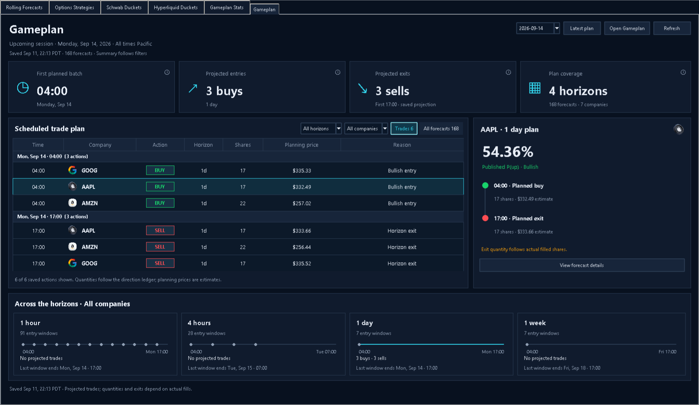

# Gameplan tab — implemented Concept A

The sixth Duckets workspace is **Gameplan**, immediately after Gameplan Stats. It displays the saved session run sheet, with conditional direction-ledger trades and all saved forecast windows.



## Behavior

- Four summary cards show the first planned batch, projected buys, projected sells and forecast coverage. Cards follow the company and horizon filters.
- The default table shows every saved direction-ledger action in chronological batches. All six September 14 actions fit together on the wide layout.
- Remaining allocations also appear at their saved expiry dates, including future sessions. They are labelled **EXPIRY**, distinct from ledger BUY/SELL events. They do not invent sale prices, double-count reserved shares as new orders, or relabel an overdue expiry as a new scheduled time.
- Selecting a row shows its published probability, saved direction, planned lifecycle and action reason. Selecting a company in the table does not silently filter the agenda.
- **All forecasts** shows every saved entry, hold, opening-gap research and later daily outlook row. Direction and planned action have separate columns. A forecast's full window, role, model status and quantity are available through **View forecast details**, double-click or Enter.
- Clicking a horizon panel filters the schedule. The four panels retain an overview across horizons for the selected company, with full dates on the last forecast-window ends.
- The date selector offers completed plans with a direction ledger. A chosen historical date stays pinned through refresh; **Latest plan** returns to following the current published trade-plan pointer.
- **Open Gameplan** opens the immutable report corresponding to the displayed snapshot.
- Loads run on a background thread and reach Tk through a queue. Obsolete responses cannot overwrite a newer choice. Date changes and failures clear misleading prior data; same-session refresh preserves selection. Refresh also runs every five minutes while visible and when reopening a tab whose load is older than 30 seconds.
- The page, table and forecast list scroll independently as needed. At narrower widths, details stack below the schedule, with the horizon overview below them. Keyboard Up/Down/Home/End moves through table rows and scrolls the selection into view.

## Data and provenance

`app/ui/gameplan_data.py` reads the latest trade-plan pointer and completed historical run receipts. It verifies the receipt, manifest and output checksums, session identity, counts, forecast identities, direction quantities and event clocks before displaying a plan. Failed or incompatible snapshots produce an explicit unavailable state.

The loader uses `direction-ledger.json` for trade quantities. It does not use standalone capacity (`projected_trade_quantity`) as an order schedule. Remaining lots come from `ending_allocations`; their reserved shares are disclosed separately. Earlier allocations can have no matching forecast in this session, in which case the inspector leaves the probability unavailable.

The viewer reads saved artifacts only. It does not fetch quotes, train, rescore, submit orders, start a trader, or change a scheduled task. Forecasts, prices and quantities remain conditional saved planning values, rather than current broker state.

Historical selection supports `cash-aware-gameplan-trade-planning-v4` and `direction-based-gameplan-cash-ledger-v1`. Earlier plans lacking the direction ledger are not reconstructed from capacity columns. The inspected datastore offered September 11 and September 14; the separate Gameplan Stats tab continues to show older verified results.

## Files

- `app/ui/gameplan.py`: native Tkinter run sheet, controls, table, inspector, horizon panels and asynchronous refresh.
- `app/ui/gameplan_data.py`: validated immutable snapshots and later-expiry presentation.
- `app/ui/gameplan_widgets.py`: the existing label, panel and tooltip helpers shared with Gameplan Stats; helper behavior is unchanged.
- `app/ui/ducket_bucket.py`: sixth-tab integration.
- `tests/gameplan_fixture.py`, `tests/test_gameplan_data.py`, `tests/test_gameplan_ui.py`: fixture integrity and behavior checks.
- `tests/visual_gameplan_fixture.py`: isolated local rendering, without starting the other workspace services.

## Verification

The focused suite passes **53 tests**, covering both Gameplan tabs and workspace mounting:

```powershell
.venv/Scripts/python.exe -m pytest tests/test_gameplan_data.py tests/test_gameplan_ui.py tests/test_gameplan_stats_data.py tests/test_gameplan_stats_ui.py tests/test_ducket_bucket_app.py -q
```

Checks include capacity-vs-ledger quantities; no-action windows; context exclusion from the trade schedule; future and unresolved expiries; reserved shares; unknown earlier-allocation forecasts; corrupt receipts/manifests/outputs; inconsistent quantities, probabilities, identities and clocks; history selection; refresh failures and stale responses; selection preservation; report opening; and callback cleanup.

Both native saved plans load successfully:

| Saved session | Forecasts | Projected ledger actions |
| --- | ---: | --- |
| September 14, 2026 | 168 | 04:00 BUY GOOG 17, AAPL 17, AMZN 22; 17:00 SELL AAPL 17, AMZN 22, GOOG 17 |
| September 11, 2026 | 168 | SELL GOOG 11, MU 3 and NVDA 17 |

Native Tk renders were inspected at 1708×990 and the default 1180×760, plus the AAPL forecast view. The narrow screenshot shows the top of the scrollable page; its inspector and horizon panels are below the schedule.

- [September 14 run sheet](implemented-gameplan-september-14.png)
- [Default window size](implemented-gameplan-default-size.png)
- [AAPL forecast windows](implemented-gameplan-forecasts.png)

To render the isolated view again:

```powershell
.venv/Scripts/python.exe tests/visual_gameplan_fixture.py --select AAPL --size 1708x990 --capture docs/gameplan-tab-design-ui/implemented-gameplan-september-14.png
```

Reopen the Duckets UI to load the new tab into a running app. Its existing launch command is `.venv/Scripts/python.exe -m app.main ui`.
