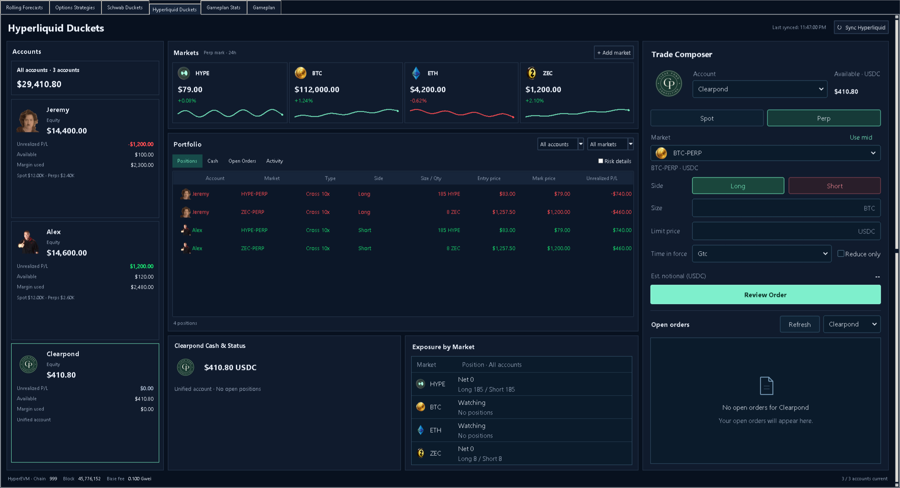

# Concept B implementation — September 13, 2026

The selected Portfolio Workspace is implemented in the existing Tk Hyperliquid
Duckets tab. Restart Duckets and choose **Hyperliquid Duckets → Sync Hyperliquid**.
Maximize the window for the three-column layout. The smaller layout places the
portfolio beside the accounts and the composer below it, with vertical scrolling.

## Actual application preview

These captures run the real widgets with deterministic **sample data**. The
fixture blocks network access and every execution adapter. Balances and market
figures in these images are illustrative, including Clearpond's original 410.80
USDC cash-only state; actual accounts now have different balances and positions.



- [Workspace at 1706 × 1030](refined-workspace.png)
- [Workspace at 2182 × 1183](refined-workspace-display-scale.png)
- [Spot composer with account orders](refined-workspace-spot-orders.png)
- [Smaller window, scrolled to composer](refined-workspace-compact.png)
- [Initial implementation](implemented-workspace.png)
- [Order activity view from initial implementation](implemented-activity.png)

## Refinement from the marked-up screenshots

Trade Composer now uses a shared label/field grid, larger account and market
icons, and consistent field heights with units inside the inputs. Spot/Perp and
Long/Short retain native keyboard and selection behavior while using rounded,
tinted button surfaces without radio indicators. The review action is taller.

Open orders has an account picker linked to the composer, a separate Refresh
action, and a centered document icon when there are no orders. Populated orders
use the same inset border and roomier rows. Exposure by Market uses token icons,
horizontal rules, and separate net and long/short lines to keep quantities clear.

The display reports 175% Windows scaling. A 2182 × 1183 logical viewport was
checked to approximate the supplied screenshot, alongside 1706 × 1030 and
1180 × 760 windows. Controls gain a modest size increase when both viewport
dimensions allow it; Windows DPI scaling is not applied twice. Resizing adjusts
existing widgets without clearing an order draft. Smaller windows retain the
workspace's vertical scrolling.

The control styling lives in `app/ui/hyperliquid_controls.py`; the generated
widget surfaces do not modify the supplied logos or design references.

## Behavior

- Jeremy, Alex, and Clearpond share one account registry for portfolio reads and
  execution. Each has an avatar, equity, unrealized P/L, available balance, margin
  used, and account-mode status. Selecting an account card filters the portfolio
  and selects that account in the composer. “All accounts” affects the portfolio;
  orders always name one account.
- HYPE, BTC, ETH, and ZEC have perpetual-mark price tiles, 24-hour changes, and
  candle sparklines. **Add market** loads choices from current exchange metadata
  and persists the expanded watchlist in
  `%LOCALAPPDATA%\Ducketz\hyperliquid-workspace.json` (up to 24 markets).
- Positions, cash, open orders, and the latest 50 fills per account have their own
  views. Account and asset filters apply to positions, orders, and fills; cash
  shows the selected accounts' cash balances. **Risk details** reveals value,
  exchange-provided ROE, and liquidation price. Missing values remain unavailable.
- The composer supports Spot and Perp limit orders, actual spot-pair routing,
  quote/base sizing, side, time in force, reduce-only perps, a mid-price helper,
  estimated notional, and the existing explicit review/confirmation flow. Changing
  account, product, or market clears the prior draft and selected order.
- Open orders retain their account and exchange order ID for edit/cancel actions.
  Trigger orders may be canceled after confirmation; editing supports limit
  orders only. Each action retains the existing local signing, enable flag, and
  maximum-notional checks.
- Account-read failures are isolated. Unavailable accounts do not become zero
  balances; aggregate equity is marked partial. Failed refreshes show stale data
  and disable new order review. Individual chart failures preserve valid prices.

## Account and balance integration

Clearpond uses the user-supplied local environment variables
`HYPE_API_CLEARPOND_WALLET` and `HYPE_API_CLEARPOND_PRIVATE`. The public `userRole`
endpoint resolves its API agent wallet to the funded account. An explicit
`HYPE_WALLET_ADDRESS_CLEARPOND` is supported as an optional override. Successful
public mappings are cached for five minutes, scoped to signer and API endpoint.
The signing key stays local and must match the configured API wallet.

Unified and portfolio-margin modes use the spot balance as equity: those balances
already include perpetual P/L. Perp notional, legacy perp account value, and P/L
are not added again. Available cash subtracts holds and respects the exchange's
maintenance-availability limit. Standard accounts continue to combine spot and
perp equity, and their cash view shows collateral rather than a negative notional
balancing entry.

Spot valuations and tickets use the actual spot pair index and token metadata,
including UBTC/USDC, UETH/USDC, and UZEC/USDC. Perpetual entry price is distinct from
mark price. Coverage uses the native Hyperliquid perpetual market catalog and
USDC spot pairs; it does not add a HIP-3 DEX integration.

Primary API references:

- [Account abstraction modes](https://hyperliquid.gitbook.io/hyperliquid-docs/trading/account-abstraction-modes)
- [Info endpoint: account addresses, userRole, orders, fills, and spot identifiers](https://hyperliquid.gitbook.io/hyperliquid-docs/for-developers/api/info-endpoint)
- [Perpetual market metadata](https://hyperliquid.gitbook.io/hyperliquid-docs/for-developers/api/info-endpoint/perpetuals)
- [Spot market metadata](https://hyperliquid.gitbook.io/hyperliquid-docs/for-developers/api/info-endpoint/spot)

## Validation

Final targeted run after refinement: **79 passed**. Compilation and
`git diff --check` also passed.

Read-only live checks succeeded for all three accounts, all four markets and
their actual spot pairs, recent fills, and open orders. Clearpond's local signing
key matches its API wallet, which resolves to its owner. Unified equity was also
cross-checked against the public portfolio history; no private values are saved
in these notes. No order was submitted, edited, or canceled by this work, and no
live-order enable flag or maximum-notional setting was changed.

The offline test suite covers owner resolution and failure, signer mismatch,
execution gates, unified/standard equity, spot price identity, chart failure,
partial account failure, draft resets, spot/perp routing, confirmation refusal,
selected-order identity, trigger-order editing, filters, watchlist persistence,
scrolling, and automatic layout resizing. Refinement checks also cover draft
preservation during resizing, the new account picker, and market selection through
the styled dropdown. The existing six-tab app and Schwab UI tests are included
because the shared UI module changed.

```powershell
.\.venv\Scripts\python.exe -m pytest tests/test_hyperliquid_workspace_services.py tests/test_hyperliquid_service.py tests/test_hyperliquid_duckets_ui.py tests/test_ducket_bucket_app.py tests/test_schwab_duckets_ui.py -q
.\.venv\Scripts\python.exe tests/visual_hyperliquid_duckets_fixture.py --size 2182x1183 --capture docs/hyperliquid-duckets-design-ui/2026-09-13-clearpond-multi-asset/refined-workspace-display-scale.png
```

Pillow 12.3.0 was installed in the local virtual environment and declared in
`pyproject.toml` and `requirements.txt` for crisp image rendering at widget sizes.

## Clearpond avatar provenance

Source: `app/ui/assets/hyperliquid/clearpond.png` (user-supplied logo sheet).
Output: `app/ui/assets/hyperliquid/clearpond-avatar.png`.
Generated with built-in ImageGen; the original logo sheet remains intact.

Exact extraction prompt:

> Extract and faithfully reproduce ONLY the dark evergreen circular CP monogram badge at the bottom center of this reference logo sheet as a standalone account avatar. It is the circular green badge with thin cream rings, cream intertwined CP letters, and the words CLEAR POND around its upper circumference and CONSULTING around its lower circumference. Preserve that exact design, proportions, dark green color and cream typography. Remove all other logos and the sheet background. One centered circular badge on a genuinely transparent background, square PNG, generous 6% transparent padding, crisp readable edges suitable for displaying at 48px. No additional shadows or new design elements.
