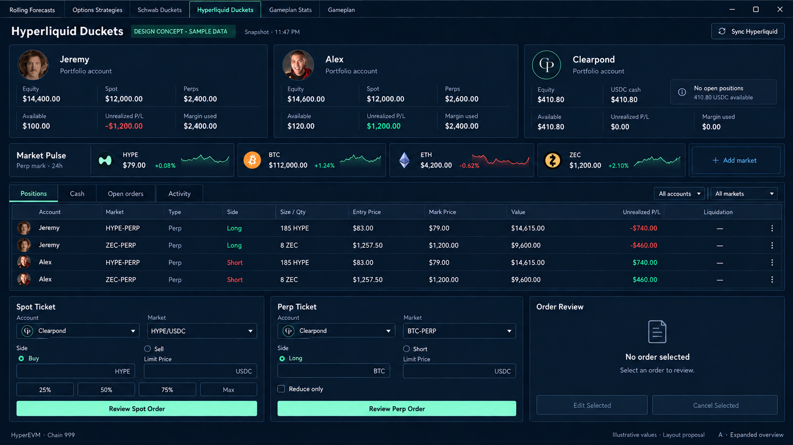
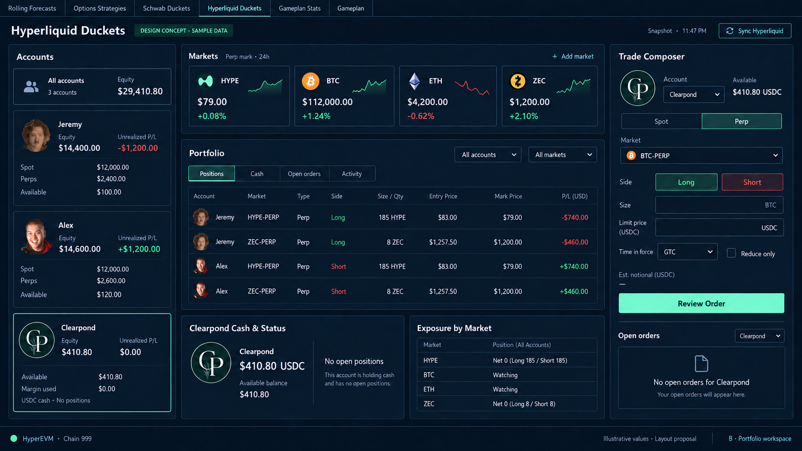
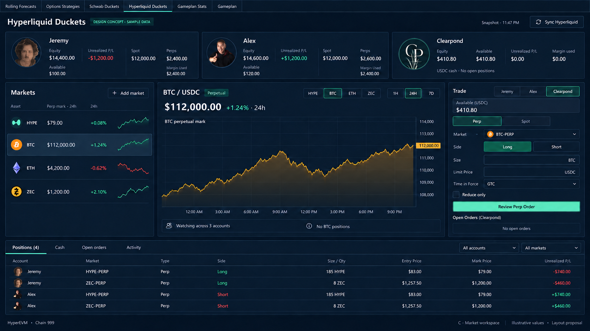

# Hyperliquid Duckets — Clearpond and multi-asset concepts

Three design directions for the next version of the existing Hyperliquid Duckets tab. These proposals precede implementation.

**Update:** Concept B was selected and implemented. See the [implementation and
actual application previews](IMPLEMENTATION.md). The discussion and figures below
record the earlier concept stage.

The scope is three accounts—Jeremy, Alex, and Clearpond—and visible HYPE, BTC, ETH, and ZEC market coverage with room for additional markets. The six current application tabs are preserved.

Recommended starting point: **B — Portfolio workspace**. It keeps all accounts visible and provides one consistent place to prepare orders as market coverage grows. A is the closest match to the current layout; C gives chart inspection more room.

## A — Expanded overview

The direct extension of the current tab: three equal account cards, a separate four-market pulse strip, a full-width positions table, and the existing separate Spot Ticket, Perp Ticket, and Order Review workflow.

Why consider it: familiar controls, easy comparison between the accounts, and the least disruption to the current page. Separating accounts from markets avoids squeezing four unrelated cards into the present three-column overview.

Tradeoff: two tickets continue to compete for space, and additional markets eventually need a scrollable pulse strip.

## B — Portfolio workspace

An account rail keeps Jeremy, Alex, and Clearpond visible together. The center contains market coverage and the shared portfolio. A single Spot/Perp composer occupies the right side and always names the account being used.

Why consider it: scales naturally as the account and market lists grow and gives order preparation one stable location. Clearpond has a useful cash and empty-position state immediately.

Tradeoff: consolidating the two ticket forms requires more UI state work than A. Changing an account or market must refresh the available balance, units, and review state together.

## C — Market workspace

Three compact account summaries sit above a market watchlist, a larger selected-market chart, and a trade composer. Positions remain visible below. BTC is selected to demonstrate that market context can follow any supported coin.

Why consider it: useful when comparing markets before preparing an order; HYPE no longer monopolizes the chart area.

Tradeoff: gives the selected market more screen space and leaves less room for broad portfolio detail. Market selection must be clearly separated from account selection.

## Shared details

- All three accounts receive a visible name and avatar. Jeremy and Alex use their existing portraits. Clearpond uses the dark evergreen circular CP monogram from the supplied logo board, rather than displaying the whole board at thumbnail size.
- All four markets are shown and an **Add market** control reserves a path for future coverage. A watched market does not imply a holding or a trade.
- The proposed market summaries use **perpetual mark prices** consistently. Spot execution still needs its actual spot-pair identity and metadata; a familiar display symbol is not sufficient on its own.
- Clearpond appears as a unified cash account with **410.80 USDC**, **$0.00 unrealized P/L**, and **no open positions**. That cash is not duplicated across Spot and Perps.
- Trade preparation always identifies one account and distinguishes Spot from Perp. The action leads to order review.
- Account and market filters, cash, positions, open orders, and activity remain distinct concepts.
- These are bitmap design studies. Menus, fields, filters, and review buttons in the images are visual proposals.

## Illustrative data

Clearpond's $410.80 balance comes from the supplied Hyperliquid screenshot; it was not verified through the account API. Other account and market figures are simplified sample values for comparing layouts. No live balance, current quote, investment recommendation, or API connection status is claimed.

| Account | Equity | Available | Unrealized P/L |
| --- | ---: | ---: | ---: |
| Jeremy | $14,400.00 | $100.00 | -$1,200.00 |
| Alex | $14,600.00 | $120.00 | +$1,200.00 |
| Clearpond | $410.80 | $410.80 | $0.00 |

The sample HYPE and ZEC positions show long exposure for Jeremy and short exposure for Alex. BTC and ETH are watched markets only. Clearpond has no sample position or open order.

## Implementation notes for the next step

The design work identified these integration points:

- `app/config.py` currently enumerates two portfolio accounts.
- `app/services/hyperliquid_trading.py` separately enumerates two trading profiles. It distinguishes the portfolio/master wallet, API wallet address, and signing secret.
- `app/ui/ducket_bucket.py` currently constructs two account cards and one HYPE Pulse card explicitly.
- `app/services/hyperliquid.py` currently gathers a HYPE-specific market snapshot and candles.
- The existing execution aliases include BTC, ETH, and ZEC, but the market-context panel is still HYPE-specific. Those aliases need metadata validation during implementation; these designs do not certify current market availability.

The user supplied the environment variable names `HYPE_API_CLEARPOND_WALLET` and `HYPE_API_CLEARPOND_PRIVATE`. Before wiring balances and signing, establish which Clearpond address is the funded portfolio/master address and which is the API signer. The current account configuration treats them separately. That distinction does not block concept review.

No local `.env` values were read for this concept work. No account connection, order, transfer, production code, trading control, or schedule was changed. Existing user edits, the supplied logo board, and the earlier concepts remain in place.

## Sources and generation

Visual inputs:

- The user's September 12 Hyperliquid account screenshot.
- The user's annotated September 12 Hyperliquid Duckets screenshot.
- The previous A/B/C images in the parent directory.
- `app/ui/assets/hyperliquid/clearpond.png`, `alex.png`, `jeremy.png`, and `hype.png`.

Generated with built-in ImageGen. The exact prompt set and per-concept previous-reference paths are saved in [PROMPTS.md](PROMPTS.md), with the subsequent label corrections in [REVISIONS.md](REVISIONS.md).
