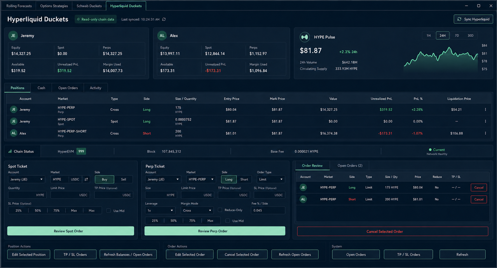
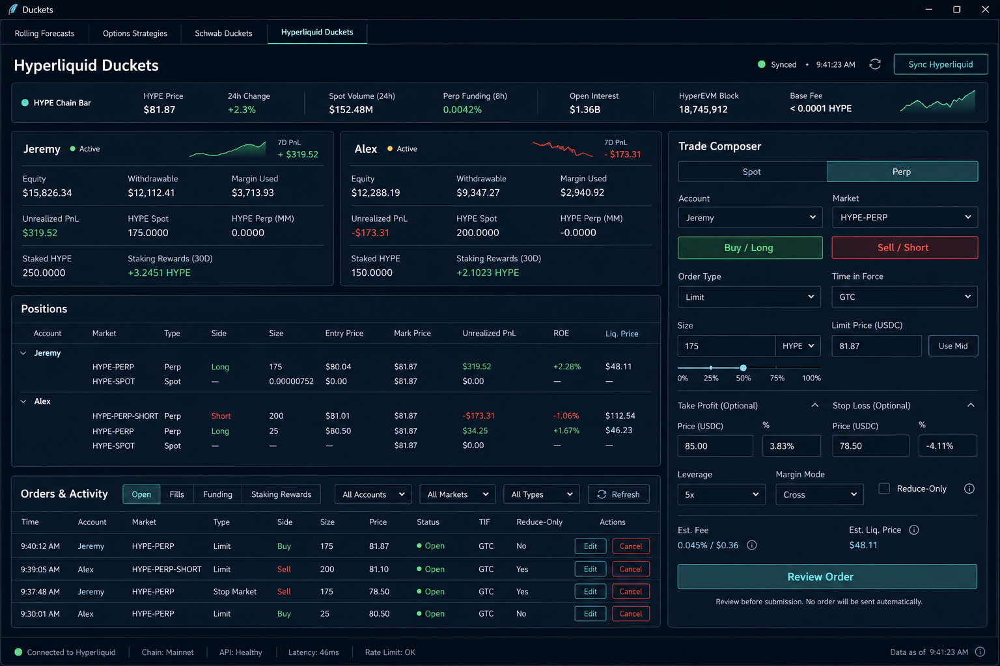
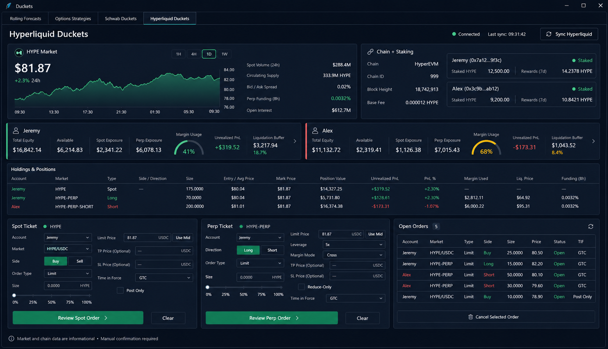

# Hyperliquid Duckets UI concepts

These are design concepts only. No Hyperliquid UI, portfolio service, execution
adapter, background loop, or scheduled task was changed while producing them.
All values shown in the mockups are illustrative snapshot data, not live quotes
or trading recommendations.

## Concept A — Portfolio + HYPE Command Center

The safest direct evolution of the existing tab. Jeremy and Alex remain visible
side by side, the current cash/holdings/open-orders information becomes a more
compact workspace, and HYPE market plus HyperEVM status gets a prominent but
bounded pulse card. Separate Spot and Perp tickets preserve today's mental model.

Implementation tradeoff: lowest layout and workflow risk. It maps closely to
the existing `PanedWindow`, `Treeview`, and separate ticket code.

## Concept B — Account Lanes + Unified Trade Composer

Optimized for daily operation. Jeremy and Alex become comparable account lanes,
while a single Spot/Perp composer removes the visual competition between two
large forms. Orders, fills, funding, and staking rewards share one activity area.

Implementation tradeoff: strongest overall workflow, but the unified composer
requires more ticket-state refactoring than Concepts A or C.

## Concept C — HYPE Market + Risk Cockpit

The most HYPE-forward direction. Market context, chain status, and staking lead
the page; account risk and holdings follow; manual Spot/Perp execution remains at
the bottom. This makes the tab useful even when no order is being prepared.

Implementation tradeoff: visually richest and most data-intensive. The chart,
margin gauges, and additional chain modules need more custom canvas work and
careful partial-failure states.

## Official API feasibility

The proposed HYPE modules are supported by Hyperliquid's public, read-only APIs:

| UI module | Official source | Existing project status |
| --- | --- | --- |
| HYPE price, 24h change, spot volume, circulating supply | `spotMetaAndAssetCtxs`; change is derived from current versus `prevDayPx` | The sync already requests this response, but does not retain all context fields |
| HYPE candle chart | `candleSnapshot` | New read-only request |
| Bid/ask spread or compact depth | `l2Book` | New read-only request |
| HYPE-perp mark, funding, open interest, oracle price | `metaAndAssetCtxs` | New read-only request |
| Equity, withdrawable balance, margin used, positions | `clearinghouseState` | Already requested; more returned fields can be retained |
| Day/week/month/all-time account value and PnL history | `portfolio` | New read-only request |
| Delegated/undelegated HYPE and pending withdrawals | `delegatorSummary` and `delegations` | New read-only requests per configured master/sub-account address |
| Staking reward history | `delegatorRewards` | New paginated read-only request |
| Current fees and staking discount | `userFees` | Optional new read-only request |
| HyperEVM chain ID, block height, and base fee | Official HyperEVM JSON-RPC: `eth_chainId`, `eth_blockNumber`, `eth_gasPrice` | New read-only RPC source, isolated from trading APIs |

Primary references:

- [Hyperliquid Info endpoint](https://hyperliquid.gitbook.io/hyperliquid-docs/for-developers/api/info-endpoint)
- [Spot endpoints](https://hyperliquid.gitbook.io/hyperliquid-docs/for-developers/api/info-endpoint/spot)
- [Perpetual endpoints](https://hyperliquid.gitbook.io/hyperliquid-docs/for-developers/api/info-endpoint/perpetuals)
- [HyperEVM](https://hyperliquid.gitbook.io/hyperliquid-docs/for-developers/hyperevm)
- [HyperEVM JSON-RPC](https://hyperliquid.gitbook.io/hyperliquid-docs/for-developers/hyperevm/json-rpc)
- [API rate limits](https://hyperliquid.gitbook.io/hyperliquid-docs/for-developers/api/rate-limits-and-user-limits)
- [Official Python SDK](https://github.com/hyperliquid-dex/hyperliquid-python-sdk)

## Safe implementation boundary

If one concept is implemented later, the additional data should be a bounded,
read-only extension of the tab's existing explicit Sync/Refresh path. Each module
should have an independent timeout, timestamp, cached last-good value, and
unavailable state so a chain-data failure cannot block portfolio balances or
manual order review. No new scheduler or background loop is required. Execution
must remain review-first with explicit confirmation and the current live-order
permission gate.

## Prompt record

The concepts were generated with the built-in ImageGen tool using the supplied
Hyperliquid Duckets screenshot as the sole visual reference.

- Concept A prompt: retain the four-tab dark desktop shell and reorganize the
  page into dual account cards, a HYPE Pulse card, tabbed positions, a chain
  status strip, separate Spot/Perp tickets, and order review. A targeted revision
  replaced direct-submit and broad close/cancel actions with review-first and
  selected-item controls.
- Concept B prompt: create parallel Jeremy/Alex account lanes, a full-width HYPE
  chain bar, shared positions/activity areas, and one Spot/Perp Trade Composer.
- Concept C prompt: make HYPE market intelligence, HyperEVM status, and staking
  the visual lead, followed by account-risk cards, holdings, separate manual
  tickets, and open orders.

All prompts required exact four-tab navigation, no Ducket Bucket tab, no secrets,
no automated execution, readable desktop typography, and implementation-friendly
controls.
