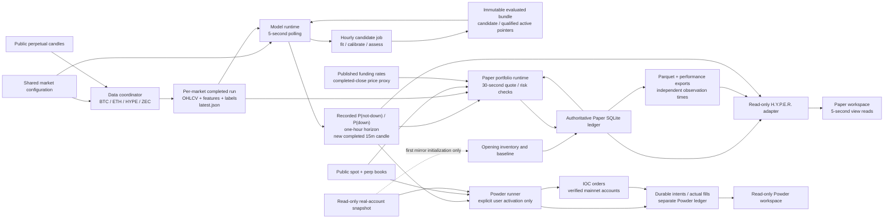

# Hyperliquid loop map and relationships

Last verified: **2026-09-25**. [Index](README.md) · [Inventory](LOOP_INVENTORY.md)

## Data, forecast and portfolio flow

Solid arrows are data dependencies, not one synchronous job chain. The data,
model and Paper owners continue independently and observe each other's saved
outputs. The UI is a consumer: it does not fetch candles, fit candidates or
initiate Paper cycles. The dashed mirror arrow is a one-time initialization
path, not recurring reconciliation with real accounts.

## Evaluation and operational evidence

```mermaid
flowchart LR
    FORECASTS["Saved forecasts before outcomes exist"] --> FORWARD["Matured forward outcomes<br/>and probability metrics"]
    LATER["Later completed candles"] --> FORWARD
    DATA["Data workers"] --> DATALOG["loop_status / loop_events<br/>work + queue measurements"]
    MODEL["Model worker + runtime"] --> MODELLOG["training_events + reports<br/>work / poll / queue / publication"]
    PAPER["Paper runtime"] --> STATUS["status.json<br/>forecast / quote / funding errors"]
    DATALOG --> OPS["H.Y.P.E.R. Operations"]
    MODELLOG --> OPS
    STATUS --> OPS
    DATALOG --> TIMINGS["On-demand timing report exports"]
    MODELLOG --> TIMINGS
```

Forward probability evaluation records what happened to saved forecasts; it
does not automatically modify ensemble weights, Paper thresholds, capital or
qualification policy. Timing exports describe measured attempts; they do not
schedule workers. There is no implemented Paper-P/L-to-retraining control path.

## Producer / consumer contracts

| Producer | Consumer | Boundary and consequence |
| --- | --- | --- |
| Market config | Data and model runtimes | Shared symbol membership; each owner applies its own reload rules. Paper also rereads membership each tick. Other settings are not universally hot-reloaded. |
| Data worker | Model runtime | Pin one completed run via `latest.json`; use its matching feature/label/catalog files. A newer pointer does not change an already selected training snapshot. |
| Candidate fit | Publication / inference | Save the exact assessed bundle. The latest candidate may be research-only; an eligible, compatible and fresh active model can remain preferred. |
| Model inference | Paper runtime | Forecast identity, source run, probability pair, symbol, interval, horizon, publication/model age and outcome deadline matter. A fresh UI read is not evidence of an eligible forecast. |
| Perpetual features | Spot allocation | Applying a perpetual directional forecast to spot is an explicit strategy assumption. Spot execution still uses the spot book. |
| Public book | Paper fill simulation | Validate the actual market book and consume available levels; a candle close or prediction decision price is not an executable quote. |
| Paper transaction | Portfolio view | SQLite records committed changes and valuations. A proposed target, a requested quantity and an executed quantity are different fields. |
| Paper ledger | Exports | Parquets/performance are derived, timestamped views. They may lag current ledger valuations. |
| All saved sources | UI | Source age, process identity, model qualification and partial/error state remain separate evidence. |

## Relationship to other Duckets systems

- The Schwab/stock/options Loops stack has its own inputs, schedules and
  execution authorities. Hyperliquid does not depend on the overnight Gameplan
  publication or share fitted model parameters with that stack.
- Shared application navigation and visual controls do not merge account
  ledgers, collateral or execution permissions.
- **Hyperliquid Duckets** retains its manual real-account workflow through
  [existing services](../../app/services/hyperliquid_trading.py).
  **H.Y.P.E.R. Paper** uses the separate simulated ledger. **Powder** has a
  separate [explicit activation path](POWDER_ACTIVATION.md) and account ownership
  locks shared with manual mutations. Neither switching tabs nor publishing a
  model activates it.
- Paper's pool is an accounting aggregate of three independent accounts. It is
  not an exchange cross-account margin facility.

## Source references

[Coordinator](../../ml/hyperliquid_coordinator.py) ·
[Data publication](../../ml/hyperliquid_data_pipeline.py) ·
[Model scheduling](../../ml/hyperliquid_model_runtime.py) ·
[Model artifacts](../../ml/hyperliquid_model_artifacts.py) ·
[Paper cycle](../../ml/hyperliquid_paper_runtime.py) ·
[Ledger](../../ml/hyperliquid_paper_ledger.py) ·
[View adapter](../../app/services/hyperliquid_paper_view.py)
