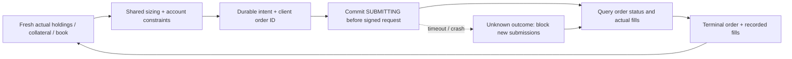

# Powder activation and recovery

Last updated: **2026-09-26** for the shared qualification setting.
[System index](README.md) · [Monitoring](MONITORING.md)

Powder is the separate, explicitly launched real-account execution runtime.
It is **disabled until the user runs its activation command**. Installing this
code, opening H.Y.P.E.R., selecting Powder, or leaving Paper running does not
start it. No scheduled activation, startup task or `.env` edit is installed.

## User commands

From a PowerShell/PyCharm terminal in `C:\dev\ducketz`, first inspect readiness:

Reopen the Duckets application once after installing this change so its manual
trading tabs load the new ownership guards. An already-running older app does
not acquire those guards retroactively; other clients remain outside local locks.

```powershell
.\Check-Hyperliquid-Powder.cmd
```

This reads exchange account/agent authority, books and local forecasts. It does
not submit an order, initialize the execution ledger, acquire trading ownership
or arm a later run. Readiness must pass again when starting.

When paper review and policy adjustments are complete, the user can start trading:

```powershell
.\Start-Hyperliquid-Powder.cmd
```

Equivalent explicit Python command:

```powershell
& .\.venv\Scripts\python.exe -m ml.hyperliquid_powder_runtime --activate --execute
```

Both flags are required. The command enables the live/Powder gates only inside
that Python session. It can submit real IOC orders immediately after its checks;
Hyperliquid is not gated by the Schwab market-opening schedule. Keep the terminal
session running. A new process requires explicit activation again.

To inspect saved state without starting anything:

```powershell
& .\.venv\Scripts\python.exe -m ml.hyperliquid_powder_runtime --status
```

To request a graceful stop, use a second terminal:

```powershell
.\Stop-Hyperliquid-Powder.cmd
```

Ctrl+C in the foreground session also stops it. A request already sent to the
exchange may complete. **Stopping leaves real positions open and stops further
risk checks; it does not flatten the accounts.** The runner uses immediate-or-cancel
orders and does not cancel unrelated orders. Check status and account evidence
after stopping. Do not delete a journal or clear an unresolved order to force a
restart.

These commands are user-operated. Codex can maintain and test this code and help
inspect readiness/reconciliation; it cannot activate an unattended real-money
trader through a chat instruction such as “activate the powder.”

## What carries over from Paper

The [Powder config](../../configs/hyperliquid-powder.json) references the current
[Paper policy](../../configs/hyperliquid-paper.json). At launch, the runner pins
validated policy, market/model configuration, account identities, interval and
horizon. The shared setting is now `require_qualified_forecasts=true`, so future
activation admits only fresh Qualified signals, with active role and an eligible
matching model record. Research publications remain visible but cannot drive
allocation. Review the pinned configuration deliberately before activation.
Changing policy/configuration while Powder is running blocks further execution;
an existing ledger's binding must remain compatible on restart.

**Paper's new no-signal hold behavior does not carry over to Powder.** Powder
still derives zero targets for missing, stale, invalid or excluded forecasts,
which can request reductions of adopted positions when executable. Paper's
`direction-volatility-v2-qualified-hold` experiment instead holds current targets
subject to independent risk exits. This change does not activate Powder.

Probability/volatility sizing and account roles are shared:

| Account | Powder-managed positions |
| --- | --- |
| Alex | Short perpetuals |
| Jeremy | Long perpetuals |
| Clear Pond | Long spot |

Matching existing positions are adopted at the first actual observation; they
are not closed merely to initialize Powder. Paper cash, positions, simulated
fills, virtual transfers and estimated funding are never imported as real state.
Existing spot has no reliable historical entry cost in the account endpoint;
its adoption mark is a **risk reference**, not an invented P/L cost basis.

Paper can continue running for comparison. Powder uses its own
`C:/DATASTORE/hyperliquid/_powder/ledger.sqlite3` and runtime status. Real holdings
and available collateral determine executable sizing, so identical forecasts
need not produce identical Paper/Powder trades.

## Order lifecycle and boundaries



- One account-owning runner can submit. The manual workspace's submit, modify
  and cancel operations share the ownership locks and are blocked for accounts
  owned by Powder. External wallet/mobile trading is not controlled by these
  local locks; unexplained holdings changes halt automation for investigation.
- Reductions are prioritized; the next decision uses fresh actual holdings.
  No atomic multi-account rebalance is assumed. Limits, stops and collateral
  checks run independently of whether a forecast has already been seen.
- Every order has a durable client ID before signing. A submission acknowledgement
  is not a fill. A timeout, missing order result, incomplete fill history or
  unresolved order blocks further submissions. It is never an instruction to
  resubmit the same economic order blindly.
- The configured maximum is **$500 per order**, further bounded by the existing
  `HYPERLIQUID_MAX_LIVE_ORDER_DOLLARS` setting. The cap applies to reductions too;
  larger target changes can require several observations/orders.
- V1 uses verified mainnet agent-to-owner identities. Subaccounts, vaults,
  portfolio-margin accounts, unknown assets/account modes, unexpected open
  orders and malformed evidence are rejected rather than guessed at.
- Price/size precision comes from market metadata. Orders use IOC with a bounded
  limit derived from the current book. Full execution is not guaranteed. A
  polled stop is not an exchange-native stop or a liquidation guarantee.

## Transfers and performance

Automatic cross-account transfers are **planned**, not implemented in this
runner. Each account uses its own available collateral and configured reserve.
There is no transfer or withdrawal call in the Powder broker. Paper's virtual
transfers do not establish real signing authority or exchange cash availability.

A future funding policy should record the reason (target allocation or margin
buffer), allowed routes/owners, amount and reserve constraints; verify authority
for that exact route; durably track transfer intent; and confirm debit and credit
before treating the funds as spendable. A transfer in flight must not be assumed
to prevent liquidation. This is a separate implementation and verification task.

The Powder tab displays actual observed equity, managed positions, durable order
decisions and confirmed fills/fee tokens. It stays empty until an actual Powder
observation exists. The shared forecast panel remains labeled as a preview.
P/L, drawdown, aggregate fees across currencies, actual funding totals and transfer
history remain unavailable until complete cashflow accounting is implemented.
A deposit or equity change is not silently presented as trading profit.

## Recovery

1. Stop new submissions and retain the original journal, account bindings,
   timestamps, client IDs and exchange order IDs.
2. Inspect the saved status and unresolved intents. Compare the same owner's
   exchange order status and actual fills; an empty open-order list does not
   establish whether an earlier IOC filled.
3. Resolve missing/ambiguous evidence before restarting. The runtime reconciles
   outstanding intents first, but does not automatically dismiss an unknown
   submission merely because one lookup returns “not found.”
4. Investigate external position changes, policy/binding mismatches or unsupported
   account routing. V1 intentionally has no force-resume/rebase command. Do not
   erase the baseline to make the check pass; preserve evidence and implement a
   reviewed migration if the strategy/account assignment must change.

## Source and verification

[Runtime](../../ml/hyperliquid_powder_runtime.py) ·
[Exchange bridge](../../ml/hyperliquid_powder_exchange.py) ·
[Ledger](../../ml/hyperliquid_powder_ledger.py) ·
[Ownership](../../ml/hyperliquid_powder_lock.py) ·
[Read-only view](../../app/services/hyperliquid_powder_view.py)

Tests use simulated exchange responses and temporary ledgers. No real order,
transfer or activation was used to verify this implementation. Live account
readiness remains a user-run check at the time of activation.

Verification on September 25: **917 tests passed in 38.14 seconds** across every
`test_hyperliquid_*.py` file plus `test_hyper_workspace.py` and
`test_ducket_bucket_app.py`. This includes Paper regression after the shared
forecast-reader extraction, crash/restart reconciliation, partial fills, base-token
fees, account ownership, final risk/forecast checks and the read-only projections.
The local `--status` inspection reported `NOT_ACTIVATED` and
`execution_enabled: false`. Normal and compact Powder screens were inspected
using [offline fixtures](../hyperliquid-duckets-design-ui/hyper-2026-09-25/IMPLEMENTATION.md).

Protocol references: [order and IOC semantics](https://hyperliquid.gitbook.io/hyperliquid-docs/for-developers/api/exchange-endpoint),
[order status and actual fill queries](https://hyperliquid.gitbook.io/hyperliquid-docs/for-developers/api/info-endpoint),
[market precision](https://hyperliquid.gitbook.io/hyperliquid-docs/for-developers/api/tick-and-lot-size),
[agent wallets and owner-address reads](https://hyperliquid.gitbook.io/hyperliquid-docs/for-developers/api/nonces-and-api-wallets).
