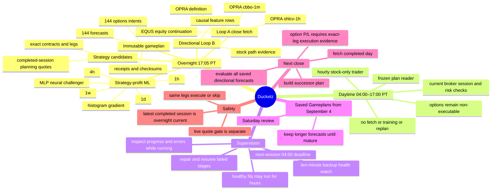

# Ducketz Loops system mind map

The detailed authority contract is `NIGHTLY_GAMEPLAN.md`. The former SVG and
editable Mermaid assets describe the legacy recurring topology and are retained
only as historical design artifacts; this inline diagram is current.
