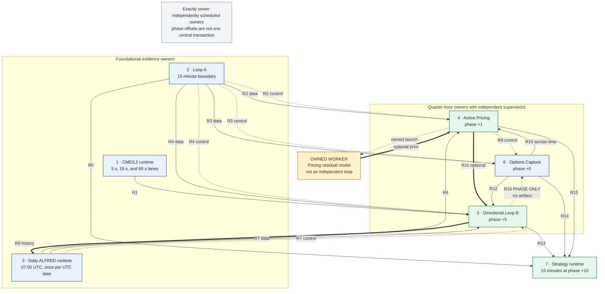
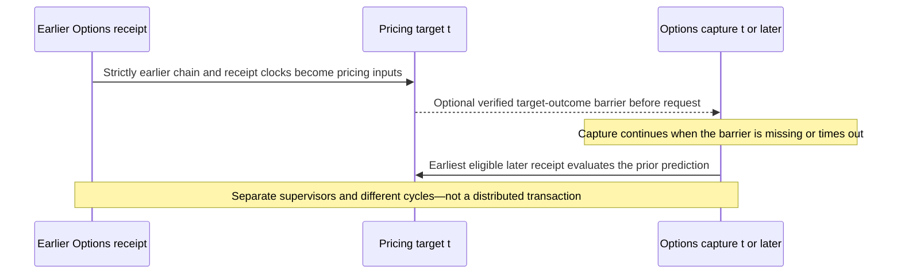
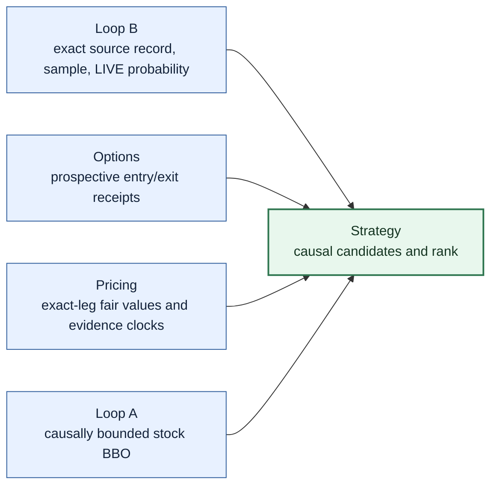
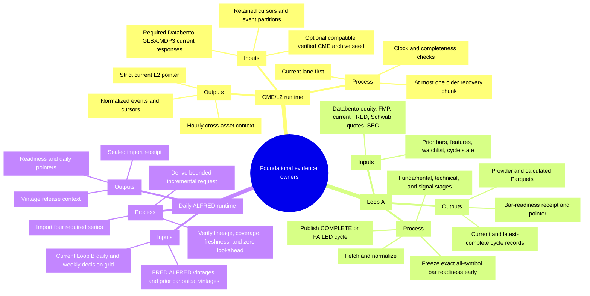
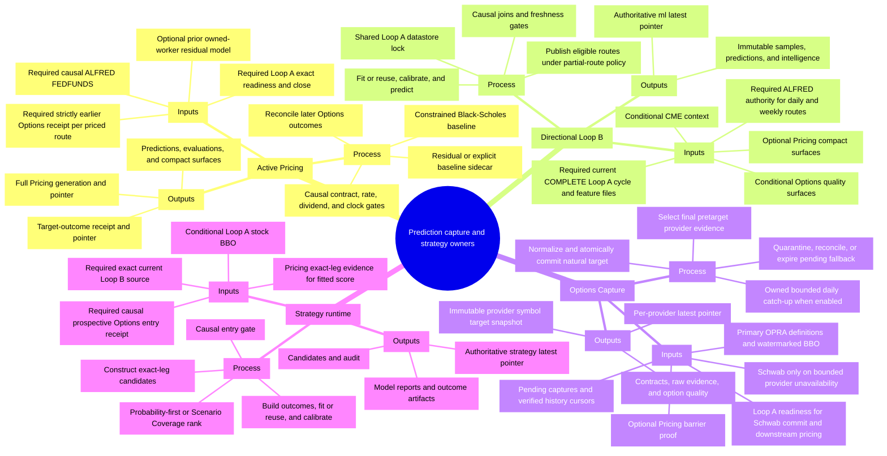

# Ducketz Loops System Mind Map

## Executive overview

The implemented production system has **exactly seven recurring owners**. Each has its own supervisor and singleton lock; there is no central transaction that starts at Loop A and commits all seven together. The quarter-hour phase offsets improve the chance that fresh evidence is available, but each owner independently decides whether to publish, skip, degrade, or retain its previous authority. The seven-owner conclusion is independently supported by the runtime monitor inventory, guardian launch inventory, production commands, and top-level recurring supervisors. `ml/system_monitor.py:80-163`, `ml/system_guardian.py:81-154`, `docs/datafetch-ml/current_start_command:3-223`

The three prediction authorities are distinct:

- **Directional Loop B** directly publishes directional-horizon predictions.
- **Active Pricing** directly publishes option-pricing predictions and target outcomes.
- **Strategy** directly publishes options-strategy candidates, scores, and ranks.

Every other prediction contribution is indirect through a verified data, model, or readiness path. Temporal proximity alone is not a contribution. In particular, **Loop B at phase +5 does not send an artifact to Options at phase +6**; that edge is phase-only. Conversely, Pricing and Options form a real cycle across time: Pricing consumes earlier Options receipts and later Options receipts evaluate prior Pricing predictions, while Options can record a nonblocking Pricing-before-request barrier proof.

Historical OPRA bootstrap/cold-start commands, Pricing's residual-model worker, monitor, guardian, UI readers, provider adapters, cold archives, and one-shot migration or administrative commands are shown only as boundaries or owned components. None is an eighth loop. `tests/test_independent_loop_isolation.py:17-66`, `ml/option_pricing_loop_native_worker.py:36-141`, `tests/test_ml_runtime_pipeline.py:454-610`

The numbering in this map is a readable functional/phase order, not an instruction to start the processes in that order and not a transaction boundary.

## Edge and node legend

| Visual form | Meaning |
|---|---|
| Solid arrow | Direct data or model flow. The consumer reads a producer artifact. |
| Dotted arrow | Readiness or control flow. It can gate or serialize work without being model data. |
| Thick arrow | Optional input, explicit fallback, historical input, or asynchronous feedback. The edge label says which. |
| Yellow dashed node labeled `owned-worker` | A one-shot child owned by Active Pricing; it is not independently scheduled. |
| Edge labeled `PHASE ONLY` | Scheduling association only; no artifact or control receipt is exchanged. |
| Blue owner node | Evidence, fetch, or capture owner. |
| Green prediction node | Owner of a prediction-family authority. |

Color is never the only encoding: every node carries its role in text, and every non-solid edge carries an explicit relationship label.

## System flow

The canonical editable source for this diagram is [assets/loops-system-mind-map.mmd](assets/loops-system-mind-map.mmd); the checked-in export is [assets/loops-system-mind-map.svg](assets/loops-system-mind-map.svg).

### Pricing and Options cycle across time

Pricing rejects an Options target already visible before prediction creation, requires source receipts to be strictly earlier, and preserves the actual later outcome target and availability rather than backdating either clock. `ml/option_pricing/causal.py:50-100`, `ml/option_pricing/causal.py:963-1105`, `tests/test_option_pricing_core.py:69-112`, `tests/test_option_pricing_core.py:389-664`

### Exact Strategy fan-in

Loop B and an eligible Options entry receipt are required for a live candidate. Pricing is required for fitted probability/actionability, but not for a separately typed Scenario Coverage row. Loop A stock BBO is a direct, conditionally required input for stock legs and an eligible causal substitute for missing OPRA underlying spot; it is not silently taken from a later quote. `ml/strategy_runtime.py:74-138`, `ml/strategy_selection/chain.py:699-798`, `ml/option_pricing/strategy_shadow.py:927-1203`, `tests/test_ml_strategy_selection.py:121-335`

## Per-loop input / process / output mind maps

The two focused views below use the same three branches for every owner: required or optional inputs, major decisions, and authoritative outputs. They intentionally omit transient process identifiers and current datastore contents.

### Foundational evidence owners

### Prediction, capture, and strategy owners

## Concise loop inventory

| # | Canonical owner and entry point | Production cadence / phase | Singleton ownership | Primary authoritative publication | Direct consumers |
|---:|---|---|---|---|---|
| 1 | CME/L2 runtime — `python -m datafetching.cme_runtime` | MBP-10 every 5 s at +0 s; BBO every 15 s at +2 s; OHLCV every 60 s at +1 s | `.ducketz-cme-writer.lock` | Event partitions/cursors, strict current L2 pointer, hourly cross-asset context | Loop B |
| 2 | Loop A — `python -m datafetching.orchestrate` | Immediate first cycle; then each 15-minute boundary with the implemented 20 s pre-start pause | `.ducketz-orchestration.lock`; shared datastore-cycle lock with Loop B | Exact bar-readiness receipt/pointer, current/latest-complete cycle records, provider and calculated Parquets | Pricing, Options, Loop B, Strategy |
| 3 | Daily ALFRED — `python -m datafetching.fred_alfred_runtime` | 07:00 UTC; at most one successful run per UTC date | `.ducketz-fred-alfred-import.lock` | Sealed import, vintage context, readiness pointer, daily receipt pointer | Pricing, Loop B |
| 4 | Active Pricing — `python -m ml.option_pricing_runtime` | Every 15 minutes at UTC phase +1 | `.ducketz-option-pricing-runtime.lock` | Target-outcome pointer and full `ml/option-pricing-latest/run.json` authority | Options, Loop B, Strategy |
| 5 | Directional Loop B — `python -m ml.prediction_runtime` | Every 15 minutes at UTC phase +5 | `.duckets-ml-prediction-runtime.lock`; shared datastore-cycle lock with Loop A | Immutable ML run and `ml/latest/run.json` | Strategy, Daily ALFRED historical scope, Rolling Forecast UI; phase-only association with Options |
| 6 | Options Capture — `python -m datafetching.options_runtime` | Every 15 minutes at UTC phase +6; pending reconciliation while waiting | `.ducketz-options-writer.lock` | Immutable provider/symbol/target snapshots and per-provider pointers | Pricing, Loop B, Strategy |
| 7 | Strategy — `python -m ml.strategy_runtime` | Every 15 minutes at UTC phase +10 | `.ducketz-strategy-runtime.lock` | Immutable strategy run and `ml/strategy-latest/run.json` | Options Strategy UI |

Cadence and lock evidence: `datafetching/cme_runtime.py:497-564`, `datafetching/orchestrate.py:169-236`, `datafetching/fred_alfred_runtime.py:150-188`, `ml/option_pricing_runtime.py:1502-1571`, `ml/prediction_runtime.py:76-204`, `datafetching/options_runtime.py:717-860`, `ml/strategy_runtime.py:342-421`, `docs/datafetch-ml/current_start_command:60-223`.

## Loop behavior contracts

### 1. CME/L2 runtime

- **Consumes:** required current `GLBX.MDP3` responses plus retained exact-spec cursors/events; an exact compatible verified CME archive scope is an optional seed/history input, never live authority.
- **Calculates and decides:** services the current window before recovery, validates provider/event/receipt clocks, normalizes three schema lanes, builds complete common-window hourly cross-asset context, and permits at most one bounded older recovery chunk per pass.
- **Publishes:** normalized event partitions and cursors, a strict configured-symbol current L2 pointer, and the hourly context consumed by Loop B.
- **Degradation:** a saturated response is split rather than cursor-skipped; incomplete or stale configured-symbol evidence cannot advance strict L2 authority. Older recovery cannot delay or weaken the current lane.
- **Prediction contribution:** directional **indirect**, Pricing **none**, Strategy **indirect through Loop B**.

Implementation and test evidence: `datafetching/cme_runtime.py:104-184`, `datafetching/cme_runtime.py:537-744`, `datafetching/cme_cross_asset_context.py:83-236`, `tests/test_cme_runtime.py:191-489`, `tests/test_cme_cross_asset_context.py:35-235`.

### 2. Loop A

- **Consumes:** the watchlist and retained datastore state; production providers are Databento equity OHLCV, FMP, current FRED, Schwab stock quotes, and SEC. It consumes no other recurring owner's publication.
- **Calculates and decides:** fetches and normalizes provider data; publishes exact all-symbol bar readiness as soon as the target bars are proven; then runs owned fundamental, technical, and signal stages and publishes a terminal cycle state.
- **Publishes:** immutable bar-readiness evidence and pointer, current and latest-complete cycle records, normalized bars/quotes, features, fundamentals, signals, and contexts.
- **Degradation:** any counted provider/calculation failure produces `FAILED`, so Loop B cannot consume that current cycle. The separate latest-complete record remains available to independent readers. Production external mode never enters compatibility-only inline CME or Options lanes.
- **Prediction contribution:** directional **indirect**, Pricing **indirect**, Strategy **indirect**.

Implementation and test evidence: `datafetching/orchestrate.py:254-441`, `datafetching/bar_readiness.py:82-235`, `datafetching/loop_a_cycle.py:76-199`, `tests/test_loop_a_orchestration.py:200-257`, `tests/test_independent_loop_isolation.py:17-66`.

### 3. Daily ALFRED runtime

- **Consumes:** required FRED/ALFRED vintages for `FEDFUNDS`, `CPIAUCSL`, `UNRATE`, and `GDP`; prior canonical vintages; and the current authoritative Loop B daily/weekly decision grid used to derive scope and prove coverage.
- **Calculates and decides:** derives bounded backfill/incremental bounds, imports and seals provider evidence, materializes release context, verifies at least 95% eligible-decision coverage and zero lookahead/freshness violations, and enforces same-date idempotence.
- **Publishes:** sealed import evidence, vintage/release-context Parquets, macro readiness receipt/pointer, and a daily runtime receipt/pointer.
- **Degradation:** missing required series, gaps, current-revised history, bad lineage, insufficient coverage, or a lookahead violation fails closed without a new readiness authorization. The one-time initial backfill is prerequisite maintenance, not another loop.
- **Prediction contribution:** directional **indirect**, Pricing **indirect**, Strategy **indirect through Loop B and Pricing**.

Implementation and test evidence: `datafetching/fred_alfred_runtime.py:46-188`, `datafetching/fred_alfred_readiness.py:98-400`, `datafetching/fred_alfred_readiness.py:494-675`, `tests/test_fred_alfred_causal_pipeline.py:116-466`.

### 4. Active Pricing

- **Consumes:** required exact Loop A target readiness/close, a causal ALFRED `FEDFUNDS` observation, and a strictly earlier committed Options surface for each priced route. Retained earlier predictions and later Options receipts support evaluation. A prior verified residual model from its owned worker is optional.
- **Calculates and decides:** admits only causal contracts/rates/dividends, publishes a constrained Black-Scholes baseline quickly, produces a one-to-one residual-or-explicit-baseline sidecar, reconciles later option outcomes, evaluates/calibrates, and builds compact surfaces plus the full generation.
- **Publishes:** target-scoped prediction-or-skip receipt/pointer; pricing samples, predictions, evaluations, monitoring, compact surfaces, reports, and the full Pricing pointer. It launches the local one-shot residual worker only after fast target publication and does not wait for it.
- **Degradation:** missing exact readiness remains retryable inside the causal window, then becomes a write-free skip that leaves prior authority unchanged. Missing residual-model support uses explicit Black-Scholes fallback; a missing/stale route is isolated; corrupted shared authority or clocks fail closed. Closed-market idle cycles do not fabricate targets.
- **Prediction contribution:** directional **indirect** through optional `opx__` features, Pricing **direct**, Strategy **indirect** through exact-leg evidence.

Implementation and test evidence: `ml/option_pricing_runtime.py:309-440`, `ml/option_pricing_runtime.py:1035-1335`, `ml/option_pricing_runtime.py:1663-1766`, `ml/option_pricing/causal.py:50-340`, `tests/test_market_cycle_coordination.py:99-370`, `tests/test_pricing_options_sequencing.py:76-526`.

### 5. Directional Loop B

- **Consumes:** required current `COMPLETE` Loop A cycle and its normalized/derived feature state while holding the shared datastore-cycle lock. Verified ALFRED authority is required for registered daily/weekly macro features. CME context and Options quality surfaces are conditional on causal availability/freshness. Pricing compact surfaces are optional; no usable surface selects the registered non-Pricing baseline, while corrupt Pricing authority is fatal.
- **Calculates and decides:** causally joins feature families at the Loop A completion cutoff; creates rolling labeled samples; fits or reuses route models; calibrates without assessment/lockbox leakage; scores eligible routes; and applies the configured partial-route policy.
- **Publishes:** immutable samples, predictions, evaluations, intelligence, manifests/receipts, and authoritative `ml/latest/run.json`.
- **Degradation:** missing or noncomplete current Loop A authority aborts the attempt. Shared ALFRED/Pricing contract corruption aborts the publication. Ordinary missing/stale optional evidence is audited as null or can fail only affected routes; production permits a verified partial route set.
- **Prediction contribution:** directional **direct**, Pricing **none**, Strategy **indirect** through exact samples and LIVE probabilities.

Implementation and test evidence: `ml/prediction_runtime.py:189-257`, `ml/rolling_materialization.py:97-387`, `ml/rolling_materialization.py:614-869`, `tests/test_ml_prediction_runtime.py:121-285`, `tests/test_option_pricing_shadow_consumers.py:656-985`.

### 6. Options Capture

- **Consumes:** the primary scoped live OPRA adapter and retained capture/pending state. An OPRA commit uses its own provider/local clocks and does not require Loop A readiness. Exact Loop A readiness is required for a Schwab commit and for downstream Pricing normalization. The Pricing barrier is optional control evidence. Schwab is allowed only for bounded provider unavailability, never for identity, clock, checksum, or integrity failures.
- **Calculates and decides:** waits at most 45 seconds for the Pricing barrier, then independently selects a final pretarget OPRA BBO by per-symbol watermark; normalizes and atomically commits the provider/symbol/target; or durably quarantines, reconciles, or expires a pending Schwab capture. Bounded daily history catch-up is owned by this runtime when enabled and valid completed cursors exist.
- **Publishes:** immutable raw/contracts/option-quality files, checksum-bound receipts, per-provider latest pointers, pending evidence, and health/cursor records.
- **Degradation:** a missing/timed-out Pricing barrier removes prospective Pricing credit but never blocks capture. OPRA unavailability can use explicitly labeled Schwab fallback. OPRA integrity errors fail the target closed without a Schwab request. Missing Loop A readiness can leave fallback pending rather than fabricate a clock.
- **Prediction contribution:** directional **indirect**, Pricing **indirect**, Strategy **indirect**.

Implementation and test evidence: `datafetching/options_runtime.py:250-614`, `datafetching/options_runtime.py:782-1008`, `options/publication.py:92-408`, `tests/test_option_publication.py:387-644`, `tests/test_pricing_options_sequencing.py:737-1212`.

### 7. Strategy runtime

- **Consumes:** required exact current Loop B record, samples, and LIVE predictions; required causal prospective Options entry receipts for live candidates; prospective Options exits for historical outcomes; exact-leg Pricing evidence for fitted probability; and causally bounded Loop A stock BBO for stock legs or missing OPRA underlying spot. Live entry and live Pricing attachment forbid offline replay.
- **Calculates and decides:** verifies the exact Loop B source; applies the causal entry gate; constructs policy-eligible exact-leg candidates; attaches Pricing evidence before fitted scoring; builds historical outcomes; fits/reuses and calibrates eligible models; otherwise retains typed Scenario Coverage; then ranks and validates the result.
- **Publishes:** immutable candidates, audit, model/outcome reports and artifacts, source lineage, receipt, and authoritative `ml/strategy-latest/run.json`.
- **Degradation:** invalid/missing current Loop B authority fails the cycle. A missing chain or entry receipt is audit-only and skips the affected route. Missing/delayed/incomplete Pricing evidence prevents fitted probability and later actionability but may leave a Research Only Scenario Coverage candidate whose probability fields are null.
- **Prediction contribution:** directional **none**, Pricing **none**, Strategy **direct**.

Implementation and test evidence: `ml/strategy_runtime.py:63-265`, `ml/strategy_selection/runtime.py:84-425`, `ml/strategy_selection/chain.py:699-901`, `ml/strategy_publication.py:41-204`, `tests/test_ml_runtime_pipeline.py:486-610`, `tests/test_ml_strategy_selection.py:121-335`.

## Prediction-contribution classification

`Direct` means the owner publishes that prediction family's authority. `Indirect` means an implemented data/control chain reaches that authority. `None` means no implemented path was found.

| Owner | Directional predictions | Pricing predictions | Strategy predictions |
|---|---|---|---|
| CME/L2 | Indirect | None | Indirect via Loop B |
| Loop A | Indirect | Indirect | Indirect |
| Daily ALFRED | Indirect | Indirect | Indirect via Loop B and Pricing |
| Active Pricing | Indirect via Loop B `opx__` | Direct | Indirect |
| Directional Loop B | Direct | None | Indirect |
| Options Capture | Indirect | Indirect | Indirect |
| Strategy | None | None | Direct |

## Causal entry gate versus Research Only / Actionable

These are two different gates at different stages.

### 1. Causal entry gate — evidence admission

Before Strategy can construct a live candidate, it must bind one exact current Loop B prediction to its sample and select an Options entry receipt whose availability lies **at or after** `information_available_at` and **strictly before** the target window, also bounded by the Strategy run cutoff. The receipt's market target must be no earlier than the sample's completed bar boundary, and the contracts must exactly match the selected surface receipt. If no such receipt exists, Strategy emits an `ENTRY_RECEIPT_UNAVAILABLE` audit row and constructs no candidate. `ml/strategy_selection/runtime.py:303-367`, `ml/strategy_selection/chain.py:699-798`

If Pricing evidence is attached, its semantic contract and clocks face another causal admission check: exact symbol/target/contract/option semantics; a prediction created and published after its own target but before the entry quote; a strictly prior source target; source/model availability no later than prediction creation; and bounded input staleness. Invalid or future Pricing evidence cannot become fitted Strategy evidence. `ml/option_pricing/strategy_shadow.py:1067-1203`

This behavior is executable and tested: the receipt interval test selects only evidence between the decision and target clocks; later stock BBO is rejected at the Strategy cutoff; and exact Pricing matching rejects future/stale or semantically different evidence. `tests/test_ml_strategy_selection.py:121-335`, `tests/test_option_pricing_shadow_consumers.py:1099-1209`

### 2. Research Only / Actionable — later quality and maturity gate

Only **after** causal admission and candidate construction does the later UI/actionability gate ask whether the candidate has:

- a fitted calibrated score basis,
- 100% exact-leg Pricing coverage,
- `Active` BSGP or explicit `Black-Scholes fallback` Pricing status, and
- passing surface, liquidity, and option-quote quality.

When all pass, the row is eligible for manual review; submission still requires user confirmation. Otherwise it is **Research Only**, and manual submission is disabled. A Scenario Coverage row is explicitly nonprobabilistic: `decision_score`, raw probability, and calibrated probability must all remain null. `ml/strategy_selection/runtime.py:810-841`, `ml/strategy_runtime.py:540-657`, `app/ui/options_strategy_data.py:289-425`, `tests/test_options_strategy_ui.py:688-790`, `tests/test_options_strategy_ui.py:1255-1271`, `tests/test_strategy_pricing_canary.py:33-56`

**Research Only never authorizes noncausal, future, timestamp-misaligned, corrupt, or semantically mismatched evidence.** It describes a causally admitted candidate that lacks later model/Pricing/quality maturity for manual actionability; it is not an exception to the causal entry gate.

## Evidence-backed relationship notes

Each cross-loop arrow below was checked at both ends: the producer publication/contract and the consumer read or gate. Tests are corroboration, not substitutes for the executable path.

### Foundational and directional relationships

| ID | Implemented relationship and semantics | Producer / consumer code and test evidence |
|---|---|---|
| R1 | **CME/L2 → Loop B — direct data, conditional by freshness.** Loop B reads the hourly common-window cross-asset context, not the strict five-minute L2 pointer. Missing first evidence can be null; stale or quality-rejected values are not substituted. | Producer: `datafetching/cme_cross_asset_context.py:83-250`, `datafetching/cme_cross_asset_context.py:415-423`. Consumer: `ml/rolling_materialization.py:796-856`. Tests: `tests/test_cme_cross_asset_context.py:35-235`, `tests/test_ml_point_in_time_ingestion.py:360-418`. |
| R2 | **Loop A → Pricing — required data + readiness control.** Exact all-symbol target receipt and completed close gate live pricing. A missed causal deadline is write-free and leaves authority unchanged. | Producer: `datafetching/orchestrate.py:292-374`, `datafetching/bar_readiness.py:82-235`. Consumer: `ml/option_pricing_runtime.py:1115-1227`. Tests: `tests/test_market_cycle_coordination.py:99-370`, `tests/test_pricing_options_sequencing.py:76-170`. |
| R3 | **Loop A → Options — conditional data + readiness control.** OPRA may commit on its own clocks; exact readiness is required for Schwab commit and downstream Pricing semantics. The latest-complete Loop A cutoff also bounds retained regime inputs. | Producer: `datafetching/bar_readiness.py:82-235`, `datafetching/loop_a_cycle.py:153-199`. Consumer: `datafetching/options_runtime.py:266-454`, `options/features.py:335-405`. Tests: `tests/test_option_publication.py:142-205`, `tests/test_option_publication.py:481-644`. |
| R4 | **Loop A → Loop B — required data + readiness/control.** Loop B shares the datastore-cycle OS lock and requires the **current** cycle to be `COMPLETE`; a prior latest-complete record cannot mask a newer `WRITING` or `FAILED` current cycle. | Producer: `datafetching/loop_a_cycle.py:76-199`, `datafetching/orchestrate.py:389-441`. Consumer: `ml/prediction_runtime.py:209-257`, `ml/rolling_materialization.py:160-387`. Tests: `tests/test_ml_prediction_runtime.py:121-285`, `tests/test_loop_a_cycle.py`. |
| R5 | **Loop A → Strategy — direct stock-BBO data, conditionally required.** Loop A persists Schwab quote-liquidity evidence; Strategy causally bounds it for stock legs and may use it for a missing OPRA underlying spot. | Producer: `datafetching/schwab_fetch.py:146-165`, `datafetching/quote_liquidity.py:173-200`. Consumer: `ml/strategy_selection/chain.py:430-470`, `ml/strategy_selection/chain.py:747-781`. Tests: `tests/test_ml_strategy_selection.py:234-335`. |
| R6 | **Daily ALFRED → Pricing — required causal model input.** Live pricing uses point-in-time `FEDFUNDS` as a decimal rate and disables an option-provider-rate substitution when the verified ALFRED/FRED input is required. | Producer: `datafetching/fred_vintages.py:344-388`, `datafetching/fred_alfred_readiness.py:185-294`. Consumer: `ml/option_pricing/rates.py:361-409`, `ml/option_pricing/causal.py:446-510`. Tests: `tests/test_fred_alfred_causal_pipeline.py:116-305`, `tests/test_option_pricing_core.py:203-236`. |
| R7 | **Daily ALFRED → Loop B — required data + readiness for daily/weekly routes.** The checksum-bound readiness authorizes vintage macro consumption only after coverage and zero-lookahead checks. Invalid shared authority aborts the materialization. | Producer: `datafetching/fred_alfred_readiness.py:185-400`, `datafetching/fred_alfred_readiness.py:616-675`. Consumer: `ml/rolling_materialization.py:755-789`. Tests: `tests/test_fred_alfred_causal_pipeline.py:116-305`, `tests/test_fred_alfred_causal_pipeline.py:350-440`. |
| R8 | **Loop B → Daily ALFRED — thick historical/model feedback, asynchronous.** The current authoritative daily/weekly decision grid determines provider bounds and readiness coverage. It is not a same-cycle barrier and does not make ALFRED part of Loop B. | Producer: `ml/runtime_pipeline.py:695-876`, `ml/current_publication.py:177-264`. Consumer: `datafetching/fred_alfred_readiness.py:98-181`, `datafetching/fred_alfred_readiness.py:404-429`. Tests: `tests/test_fred_alfred_causal_pipeline.py:306-426`. |

### Pricing, Options, and Strategy relationships

| ID | Implemented relationship and semantics | Producer / consumer code and test evidence |
|---|---|---|
| R9 | **Pricing → Options — optional readiness/control.** Options waits a bounded interval for the exact target outcome and embeds verified barrier proof. Capture continues on missing/timeout/failure, but prospective Pricing-before-request credit is denied. | Producer: `ml/option_pricing/target_outcome.py:93-333`. Consumer: `datafetching/pricing_barrier.py:29-217`, `datafetching/options_runtime.py:250-369`. Tests: `tests/test_pricing_options_sequencing.py:327-525`, `tests/test_pricing_options_sequencing.py:737-809`, `tests/test_pricing_options_sequencing.py:1213-1292`. |
| R10 | **Options → Pricing — direct data/model across time.** Strictly earlier OPRA-first/Schwab-fallback chains supply contracts, IV, and BBO; the earliest eligible later receipt reconciles prior predictions and preserves the later clocks. | Producer: `options/publication.py:92-408`, `options/publication.py:402-535`. Consumer: `ml/option_pricing/causal.py:50-340`, `ml/option_pricing/causal.py:963-1105`. Tests: `tests/test_option_pricing_core.py:69-112`, `tests/test_option_pricing_core.py:389-664`, `tests/test_pricing_options_sequencing.py:367-449`. |
| R11 | **Pricing → Loop B — thick optional/fallback data.** Loop B reads verified compact `opx__` surfaces at its cutoff. Missing/stale/uncovered evidence selects the registered baseline; corrupt authority fails closed instead of falling back. | Producer: `ml/option_pricing/publication.py:379-530`, `ml/option_pricing/consumers.py:306-430`. Consumer: `ml/rolling_materialization.py:663-736`. Tests: `tests/test_option_pricing_shadow_consumers.py:432-637`, `tests/test_option_pricing_shadow_consumers.py:656-985`. |
| R12 | **Options → Loop B — direct option-quality data.** Receipt-committed OPRA-first surfaces at or before the input cutoff feed `opt__`; legacy files are used only when no committed history exists. Invalid receipts do not become null fallback. | Producer: `options/publication.py:402-535`, `options/features.py:217-335`. Consumer: `ml/rolling_materialization.py:614-662`. Tests: `tests/test_option_publication.py:31-77`, `tests/test_ml_loop_a_all_family_wiring.py:435-548`. |
| R13 | **Loop B → Strategy — required data + model + exact-source control.** Strategy captures one verified current pointer record, samples, and LIVE probabilities and checksum-binds that exact source into its own manifest/receipt. | Producer: `ml/current_publication.py:177-264`, `ml/runtime_pipeline.py:695-876`. Consumer: `ml/strategy_runtime.py:74-138`, `ml/strategy_runtime.py:213-265`, `ml/strategy_publication.py:41-184`. Tests: `tests/test_ml_runtime_pipeline.py:486-610`. |
| R14 | **Options → Strategy — required live-entry data/model; historical exits for model outcomes.** Prospective receipts are OPRA-first per natural target with verified Schwab fallback. Live entry forbids full historical replay; missing entry/exit evidence is audited and skipped. | Producer: `options/publication.py:402-535`. Consumer: `ml/strategy_selection/chain.py:111-470`, `ml/strategy_selection/chain.py:699-798`, `ml/strategy_selection/runtime.py:303-367`, `ml/strategy_selection/runtime.py:461-590`. Tests: `tests/test_ml_strategy_selection.py:121-414`, `tests/test_ml_strategy_selection.py:1383-1415`. |
| R15 | **Pricing → Strategy — direct model data with explicit fallback.** Strategy matches exact option legs to receipt-proven live BSGP or Black-Scholes evidence. Full causal coverage and quality admit fitted scoring; otherwise the row stays nonprobabilistic Scenario Coverage. | Producer: `ml/option_pricing/target_outcome.py:93-333`, `ml/option_pricing/publication.py:379-530`. Consumer: `ml/option_pricing/strategy_shadow.py:84-317`, `ml/option_pricing/strategy_shadow.py:927-1203`, `ml/strategy_selection/runtime.py:368-405`. Tests: `tests/test_option_pricing_shadow_consumers.py:999-1388`, `tests/test_strategy_pricing_canary.py:33-56`. |
| R16 | **Loop B → Options — phase-only.** B is configured at +5 and Options at +6, but Options imports/reads no Loop B publication. Its implemented inputs are provider evidence, Loop A readiness/state, Pricing barrier, and pending/history state. | Schedules: `docs/datafetch-ml/current_start_command:176-210`, `ml/prediction_runtime.py:76-204`, `datafetching/options_runtime.py:717-860`. Input path: `datafetching/options_runtime.py:250-614`. Tests: `tests/test_independent_loop_isolation.py:17-66`, `tests/test_pricing_options_sequencing.py:737-809`. |

### Owned-worker relationship

Active Pricing launches `ml.option_pricing_loop_native_worker` after publishing the fast target and does not wait for it. The worker performs one local materialize/train/status pass under its own collision lock, makes no provider request, and has no recurring scheduler. A later Pricing cycle may consume its verified prior residual generation; live Pricing can always retain the constrained Black-Scholes baseline. This is an **owned-worker** edge, not an eighth owner. `ml/option_pricing_runtime.py:327-440`, `ml/option_pricing_loop_native_worker.py:36-141`, `tests/test_option_pricing_loop_native_bsgp.py:728-978`.

## Boundaries that are not independent loops

| Boundary | Why it is not another loop |
|---|---|
| Historical OPRA bootstrap and Databento cold start | One-shot, explicitly scoped maintenance commands. They seed canonical history/cursors but do not own a recurring supervisor or live snapshot/prediction authority. |
| Pricing residual-model worker | One-shot child launched by Active Pricing after fast publication; no recurrence and no provider request. |
| Monitor and guardian | Observer and guarded recovery controller. Neither publishes market/model authority; the guardian can mutate process state only under a separate repair mode. |
| Rolling Forecast and Options Strategy UIs | Read-only consumers of verified Loop B and Strategy authorities. |
| Provider adapters | Transports injected into an owning loop; the live OPRA adapter shares Options Capture's lifecycle. |
| Cold archives | Historical retained state. A verified compatible CME archive can seed/history-feed CME; the differently identified equity cold archive is not merged into Loop A's current operational dataset. |
| Migration, diagnostic, backfill, lockbox, and administrative commands | Requested operations that terminate. They do not have a top-level recurring schedule plus exclusive production authority. |

Exclusion evidence: `datafetching/options_history.py`, `datafetching/databento_cold_start.py`, `datafetching/databento_archive.py:213-620`, `ml/option_pricing_loop_native_worker.py:36-141`, `ml/system_monitor.py:80-164`, `ml/system_guardian.py:81-237`, `app/ui/rolling_forecast_data.py:403-539`, `app/ui/options_strategy_data.py:628-792`.

## Durable architecture versus operational observation

Everything above this section is durable architecture derived primarily from executable code and verified publication contracts. It intentionally contains no transient PID, current run directory, current contract symbol, or row count.

**Observed 2026-08-20 05:12:04 UTC:** a read-only hourly `ml.system_monitor` run returned `HEALTHY`, with 19 `PASS`, one market-aware `INFO`, zero `WARN`, and zero `FAIL`. It verified exactly one canonical launcher/worker pair and one matching singleton lock for each of the seven owners. The sole `INFO` was the legitimate closed-market absence of a new Pricing target; no backdated target was fabricated. The report declared `read_only=true`, `orders_placed=0`, and no attention item. No production process was started, stopped, restarted, signaled, or repaired during this audit.

That timestamped observation corroborates deployment state only. It is not part of the owner inventory, relationship contract, cadence, or diagram.

## Audit basis and maintenance rules

The map follows this evidence order:

1. Executable supervisors, producer code, and consumer code.
2. Checksum-bound publication, receipt, pointer, and Parquet contracts.
3. Read-only operational evidence with an explicit timestamp.
4. Existing repository documentation.

Every relationship ID maps to one producer and one consumer implementation above. When a contract changes, update the relationship row and both diagrams together; do not infer an edge from a phase offset, shared provider, shared directory, or UI presentation alone.

The repository establishes exactly seven in-tree recurring production owners. It cannot prove that untracked operating-system schedulers or external deployment wrappers do not exist. It also does not establish current provider entitlement, empirical feature lift, current model maturity, or profitability; those require current receipts and chronological evaluation evidence rather than an architecture map.
