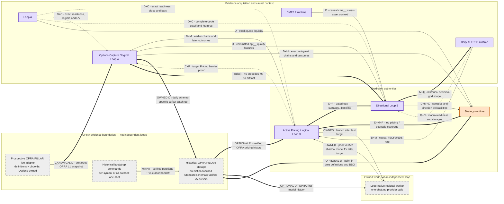

# Complete Loops system map

## Production ownership and direct relationships



Edge notation is semantic as well as visual:

- solid arrow `→`: direct data or model-evidence flow;
- dotted arrow: readiness/control flow (possibly carrying data too);
- thick arrow: optional, fallback, asynchronous-historical, or documented timing association;
- gray dashed worker node inside the `Owned work` subgraph plus an `OWNED` edge label: owned-worker launch/return, not an independent loop relationship.
- gray OPRA boundary nodes are provider/maintenance interfaces, not additional production owners; the live transport is required at production startup, while a particular target may still lack usable OPRA evidence and take the explicit Schwab fallback.

Node colors classify owner-level prediction contribution: blue = Horizon, orange = Options, purple = Both, gray/dashed = supporting/owned component. This inventory has no Horizon-only or owner-level supporting-only loop; the colors remain in the legend because those are valid classification states. `Both` signifies an evidenced causal path, not measured feature lift.

## Edge evidence

Every edge in the map is supported on both its producer and consumer sides. `T(doc)` is intentionally not treated as a data/control dependency.

| From → to | Exchange/type | Producer evidence | Consumer evidence | Status |
|---|---|---|---|---|
| CME → B | `D`: hourly `cme__` context | `datafetching/cme_cross_asset_context.py:181`, `datafetching/cme_cross_asset_context.py:277` | `ml/rolling_materialization.py:782` | **Confirmed** |
| Loop A → Pricing | `D+C`: exact bar receipt/close/bars | `datafetching/orchestrate.py:292`, `datafetching/bar_readiness.py:120` | `ml/option_pricing_runtime.py:1116`, `ml/option_pricing_runtime.py:1181` | **Confirmed** |
| Loop A → Options | `D+C`: readiness, regime cutoff, realized-volatility bars | `datafetching/bar_readiness.py:82`, `datafetching/loop_a_cycle.py:153` | `datafetching/options_runtime.py:270`, `datafetching/options_runtime.py:335` | **Confirmed** |
| Loop A → B | `D+C`: complete-cycle cutoff/features/shared lock | `datafetching/loop_a_cycle.py:127`, `datafetching/loop_a_cycle.py:198` | `ml/prediction_runtime.py:209`, `ml/rolling_materialization.py:272` | **Confirmed** |
| Loop A → Strategy | `D`: stock quote-liquidity | `datafetching/main.py:257` | `ml/strategy_selection/chain.py:151`, `ml/strategy_selection/chain.py:258` | **Confirmed** |
| ALFRED → Pricing | `D+M`: causal FEDFUNDS | `datafetching/fred_vintages.py:344`, `datafetching/fred_vintages.py:364` | `ml/option_pricing/rates.py:361`, `ml/option_pricing_loop_native_worker.py:54` | **Confirmed** |
| ALFRED → B | `D+C`: vintage macro/readiness | `datafetching/fred_alfred_readiness.py:185`, `datafetching/fred_alfred_readiness.py:667` | `ml/rolling_materialization.py:740`, `ml/rolling_materialization.py:757` | **Confirmed** |
| B → ALFRED | `M+H`: decision-grid planning/coverage scope | `ml/runtime_pipeline.py:695`, `ml/runtime_pipeline.py:794` | `datafetching/fred_alfred_readiness.py:400`, `datafetching/fred_alfred_readiness.py:420` | **Confirmed, asynchronous historical feedback** |
| Pricing → Options | `C+F`: verified target outcome/barrier proof | `ml/option_pricing/target_outcome.py:93`, `ml/option_pricing_runtime.py:1305` | `datafetching/pricing_barrier.py:77`, `datafetching/options_runtime.py:250` | **Confirmed; capture can continue without it** |
| Options → Pricing | `D+M`: earlier contracts/IV and later outcomes | `options/publication.py:92`, `options/snapshot.py:201` | `ml/option_pricing/causal.py:107`, `ml/option_pricing_runtime.py:660` | **Confirmed** |
| Pricing → B | `D+F`: `opx__` surface family/baseline gate | `ml/option_pricing_runtime.py:707`, `ml/option_pricing/publication.py:83` | `ml/rolling_materialization.py:663`, `ml/runtime_pipeline.py:432` | **Confirmed, optional-by-gate** |
| Options → B | `D`: `opt__` quality features | `options/features.py:214`, `options/publication.py:92` | `ml/rolling_materialization.py:614` | **Confirmed** |
| B → Strategy | `D+M+C`: samples, LIVE probability and source authority | `ml/runtime_pipeline.py:704`, `ml/runtime_pipeline.py:876` | `ml/strategy_runtime.py:74`, `ml/strategy_runtime.py:125` | **Confirmed, mandatory** |
| Options → Strategy | `D+M`: exact entry/exit chains/outcomes | `options/publication.py:92`, `options/snapshot.py:499` | `ml/strategy_selection/runtime.py:240`, `ml/strategy_selection/runtime.py:395` | **Confirmed** |
| Pricing → Strategy | `D+M+F`: per-leg fair value/edge/uncertainty | `ml/option_pricing/publication.py`, `ml/option_pricing/strategy_shadow.py` | `ml/strategy_selection/runtime.py` | **Confirmed, separately typed scenario coverage when fitted scoring is unavailable** |
| B → Options | `T(doc)`: +5 then +6 only | `docs/datafetch-ml/current_start_command:188` | `docs/datafetch-ml/current_start_command:99`, `docs/datafetch-ml/current_start_command:160`, `datafetching/options_runtime.py:700` | **Documented only; no exchanged artifact** |
| Pricing ↔ worker | owned launch and future shadow model | `ml/option_pricing_runtime.py:418`, `ml/option_pricing_runtime.py:440` | `ml/option_pricing_loop_native_worker.py:38`, `ml/option_pricing_loop_native_worker.py:135` | **Confirmed owned worker** |
| Prospective OPRA adapter → Options | canonical `D`: scoped `OPRA.PILLAR` definitions plus `cbbo-1s` final pretarget BBO; one shared live transport | `options/databento_live.py:33`, `options/databento_live.py:139`, `options/databento_live.py:268` | `datafetching/options_runtime.py:369`, `options/snapshot.py:122` | **Confirmed production transport; per-target transient unavailability permits labeled Schwab fallback** |
| Bootstrap commands → historical OPRA storage | maintenance: one-time per-parent included Standard-plan bootstrap or `--confirm-download` all-dataset cold start; entitlement/capacity checks, verified partitions, and v5 symbol/schema cursor handoff | `datafetching/options_history.py`, `datafetching/databento_cold_start.py:665` | `datafetching/options_runtime.py:1018`, `datafetching/options_runtime.py:1107` | **Confirmed one-shot maintenance; no snapshot/readiness/publication authority** |
| Options → historical OPRA storage | owned `C`: at most one catch-up per UTC date for valid v5 cursors; narrowly compatible legacy v4 cursors require the exact old policy | `datafetching/options_runtime.py:1018`, `datafetching/options_runtime.py:1137` | `datafetching/databento_opra_history.py` | **Confirmed owned maintenance; missing/invalid cursors require a one-time bootstrap** |
| Historical OPRA storage → Pricing | optional `D`: verified immutable definitions/CBBO evidence for causal replay, model fit, and evaluation | `datafetching/databento_opra_history.py` | `ml/option_pricing/opra_materialization.py` | **Confirmed local-data boundary; no provider call by Pricing** |
| Historical OPRA storage → worker | optional `D`: OPRA-first committed history | `datafetching/databento_opra_history.py` | `ml/option_pricing_loop_native_worker.py:58`, `ml/option_pricing_loop_native_worker.py:72` | **Confirmed owned-worker input** |
| Historical OPRA storage → Strategy | optional `D`: point-in-time definitions plus `cbbo-1m` or `cbbo-1s`; Schwab history only when OPRA is unavailable | `datafetching/databento_opra_history.py` | `ml/strategy_selection/chain.py` | **Confirmed OPRA-first provider-neutral history** |

## Ordinary production phase order

This sequence is scheduling intent plus implemented bounded waits, not a central transaction. CME and ALFRED are asynchronous to the quarter-hour chain; process latency, missing readiness and causal deadlines can change completion order.

```mermaid
sequenceDiagram
    participant C as CME/L2 (continuous)
    participant F as Daily ALFRED (07:00 UTC)
    participant A as Loop A (+00:20 intent)
    participant P as Active Pricing (+01)
    participant B as Directional B (+05)
    participant O as Options Capture (+06)
    participant S as Strategy (+10)

    C->>C: Publish sub-minute events and causal hourly context
    F->>F: Import/seal vintages and publish readiness once per UTC date
    A->>A: Quarter-hour cycle; publish exact readiness, then complete-cycle authority
    A-->>P: Exact all-symbol target receipt and close
    P->>P: Wait up to configured 30 s; publish target outcome or skip by deadline
    P-->>O: Verified target outcome if available before request
    A-->>B: Complete-cycle cutoff under shared lock
    B->>B: Materialize, fit/reuse, score and atomically publish
    O->>O: Wait up to 45 s; read owned OPRA buffer first or use labeled Schwab fallback
    O-->>P: Committed chain becomes input/outcome for later Pricing work
    B-->>S: Current samples and LIVE direction probability
    O-->>S: Exact chain/stock evidence available by Strategy cutoff
    P-->>S: Verified per-leg Pricing or explicit fallback state
    S->>S: Fit/reuse, score, rank and atomically publish
```

**Confirmed phase evidence:** CME schema phases are +0/+2/+1 seconds; Loop A applies a 20-second prestart wait after recurring boundaries; Pricing/B/Options/Strategy use +1/+5/+6/+10 minutes; ALFRED’s production next boundary is 07:00 UTC. `datafetching/cme_runtime.py:42`, `datafetching/orchestrate.py:210`, `docs/datafetch-ml/current_start_command:72`, `docs/datafetch-ml/current_start_command:94`, `docs/datafetch-ml/current_start_command:160`, `docs/datafetch-ml/current_start_command:188`, `docs/datafetch-ml/current_start_command:199`

**Inferred ordinary order:** Loop A readiness normally precedes Pricing, while the complete Loop A cycle precedes B; Options then captures and Strategy consumes the current evidence. The processes remain independently scheduled and the two bounded barriers do not guarantee completion in this order. `datafetching/bar_readiness.py:245`, `datafetching/pricing_barrier.py:77`

## Relationships that need prose

- **Pricing ↔ Options is deliberately cyclic across time.** Pricing uses an earlier committed chain to predict a target and a later chain to evaluate it; Options optionally records proof that Pricing existed before its request. That barrier changes causal credit, not whether capture may occur. `ml/option_pricing/causal.py:107`, `datafetching/pricing_barrier.py:52`
- **B ↔ ALFRED is not a same-cycle deadlock.** B consumes already-authorized macro history. The daily owner uses the current B decision grid only to determine historical import/readiness coverage for later B runs. On a new datastore, an authoritative base/earlier-profile B sample grid must exist before the one-time ALFRED backfill can derive bounds; the v3 profile is started after that bootstrap. `datafetching/fred_alfred_readiness.py:400`, `docs/datafetch-ml/current_start_command:21`
- **Pricing → B is fallback-aware.** Missing/stale but structurally valid `opx__` evidence triggers a versioned baseline model feature set. Corrupt Pricing authority is not a fallback condition and aborts the new B publication. `ml/runtime_pipeline.py:455`, `ml/rolling_materialization.py:322`
- **Pricing → Strategy is candidate-specific.** Full active quality-passing leg coverage admits the fitted Strategy model; uncovered/delayed candidates retain non-probabilistic Scenario Coverage while raw, calibrated and decision probabilities remain null. `ml/strategy_selection/runtime.py`, `ml/strategy_runtime.py`
- **OPRA has two non-owner entry boundaries.** Prospective `cbbo-1s` enters through the concrete live adapter constructed by the Options CLI in default `opra-canonical` mode. Historical Standard data enters through the one-time per-symbol bootstrap, the one-time all-dataset cold-start, or the administrative synchronizer. Verified per-symbol/cold-start work publishes a v5 history-cursor handoff; Options then owns daily overlap maintenance. Pricing and Strategy read verified local partitions OPRA-first; neither makes a historical provider request. Schwab remains a lazily constructed, explicitly labeled per-target fallback/broker lane. `datafetching/options_history.py`, `datafetching/databento_cold_start.py`, `datafetching/options_runtime.py`, `ml/option_pricing_opra.py`, `ml/option_pricing/opra_materialization.py`, `ml/strategy_selection/chain.py`
