# Current Loops map

```mermaid
flowchart LR
    WR["Sunday 09:00 Pacific research report"] --> OS["User selects companies for onboarding"]
    OS --> PF["Verify report identity, 2018 floor,<br/>included-plan quote and history receipts"]
    PF -->|candidate watchlist| A
    D["Existing DATASTORE + providers"] --> A["21:05 Pacific daily<br/>fetch and append completed session"]
    A --> B["Build directional data and models"]
    B --> X["Maintain verified XNAS target history"]
    X --> E["Evaluate all saved Gameplans<br/>keep forecasts pending until mature"]
    E --> G["Train and save next-session Gameplan<br/>24 forecasts + 24 intents per symbol"]
    E -->|optional options scope| T["Train Strategy models"]
    T --> S["Generate Strategy candidates"]
    S --> G
    G --> N["Train separate independent sizing models"]
    N --> Q["Required trade-plan review<br/>capacity + direction quantities, working prices"]
    Q --> C["One hourly cash/stock projection<br/>bearish sales, due exits, bullish buys"]
    C --> F["End-of-day cash and holdings<br/>later horizon positions remain held"]
    Q --> V["Separate immutable review pointer<br/>all 24 × N forecast rows retained"]
    Q -->|onboarding batch only| AV["Verify data, four horizons,<br/>Gameplan and review bindings"]
    AV --> AW["Atomically activate selected symbols<br/>in production watchlist"]
    AW --> D
    G --> P["Saved Gameplans<br/>September 4 onward"]
    P --> E
    G --> U["Duckets forecast display"]
    G --> J["03:55 PT Scheduled default start<br/>adopt existing manual worker if present"]
    J --> H["One independent worker<br/>04:00–17:00 action windows"]
    M["One user manual start<br/>Gameplan current-market policy"] --> Z["Sleep with local heartbeat<br/>automatic 04:00 Pacific wake"]
    Z --> H
    G --> Z
    H --> R["Current quotes, broker session,<br/>risk and exact-once checks"]
    E --> W["Saturday review<br/>evaluated and pending forecasts"]
    O["Overnight Scheduled supervisor<br/>read progress/errors; repair and resume"] -.-> A
    O -.-> B
    O -.-> T
    O -.-> S
    O -.-> G
    O -.-> N
    O -.-> Q
    K["Every 90 minutes operations watch<br/>one supervision owner at a time"] -.-> O
```

## Authority rules

- Solid arrows show workflow/data dependencies; dashed arrows show supervision.
- Research publication proposes companies; explicit selection starts the
  [onboarding path](RESEARCH_SYMBOL_ONBOARDING.md). The candidate generation
  must verify before membership changes, and membership does not start a trader.
- The required review follows enrichment on the same pinned Gameplan and
  original deadline. Capacity quantities remain independent opportunities;
  adjacent direction quantities use fresh cash/all-configured-symbol holdings through one
  shared ledger. Rows show post-hour balances; expiry proceeds enter once.
  Actual orders use current broker balances and quote prices. The manual
  Gameplan strategy shares forecast directions with this conditional projection
  and does not copy assumed fills or cash into the live ledger.
- Direction uses 54%/46% thresholds separately from model approval. Review
  labels count the completed source session as Day 1 and the upcoming session
  as Day 2, with actual dates. Neutral adds no trade. Working prices use a
  historical median with +/-20bps allowance, not a confidence interval; at least
  two historical pairs remain required. See the
  [cash/stock projection contract](NIGHTLY_GAMEPLAN.md#account-aware-trade-plan-review).
- Planning price/cash ranges are estimates only, with no execution-gating
  authority. Manual BUY limits use current ask and SELL limits current bid.
- A user manual start enables the Gameplan worker once. Before 04:00 it holds
  its process lock and checks local controls only, then wakes without another
  prompt. The 03:55 Scheduled launcher adopts that verified process if present;
  its default fixed-policy command and recurring schedule remain unchanged.
- OPRA history is Loop A-owned stage work, not a separate scheduled loop.
- Completed-session quote evidence is valid for overnight planning even when
  hours old after close.
- A future live option execution must revalidate the same frozen legs and can
  execute or skip only.
- The live daytime stock reader does not fetch, train, or replan. It may place
  only a risk-gated stock order when both activation controls and `--execute`
  are present; the paper reader remains broker-free.
- The Duckets UI reads the immutable pointer directly and rotates display rows
  on hourly clock boundaries; it does not require the daytime reader schedule.
- Realized option P/L is not inferred from a frozen intent; it requires an
  exact-leg execution receipt. Unexecuted studies must be labeled
  counterfactual.

Research-selected stocks enter through the [batch onboarding path](RESEARCH_SYMBOL_ONBOARDING.md), which verifies data, trains the full candidate universe, and activates membership atomically. Sunday report publication alone does not change the universe.
