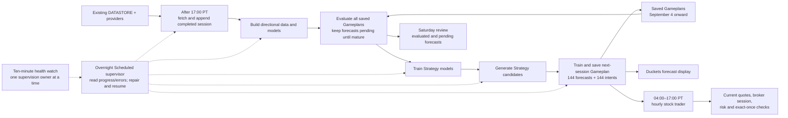

# Current Loops map

## Authority rules

- Solid arrows show workflow/data dependencies; dashed arrows show supervision.
- OPRA history is Loop A-owned stage work, not a separate scheduled loop.
- Completed-session quote evidence is valid for overnight planning even when
  hours old after close.
- A future live option execution must revalidate the same frozen legs and can
  execute or skip only.
- The live daytime stock reader does not fetch, train, or replan. It may place
  only a risk-gated stock order when both activation controls and `--execute`
  are present; the paper reader remains broker-free.
- The Duckets UI reads the immutable pointer directly and rotates display rows
  on hourly clock boundaries; it does not require the daytime reader schedule.
- Realized option P/L is not inferred from a frozen intent; it requires an
  exact-leg execution receipt. Unexecuted studies must be labeled
  counterfactual.
