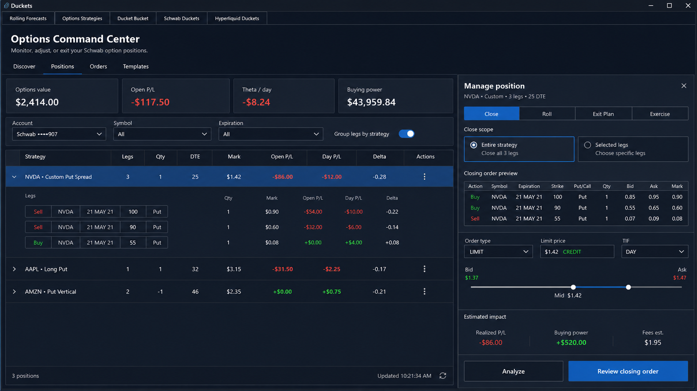
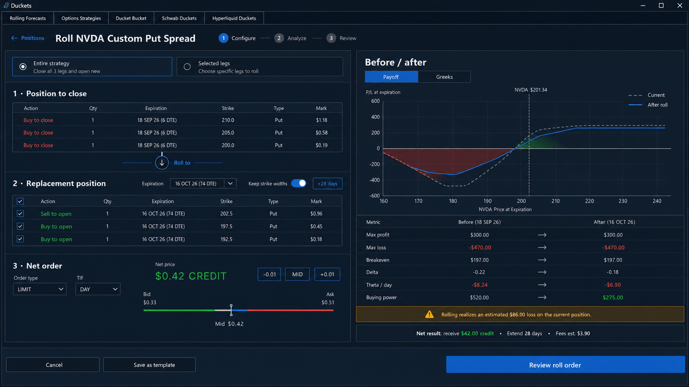
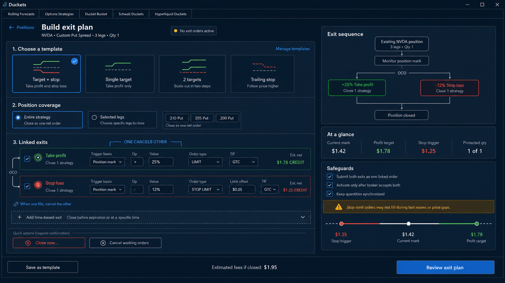
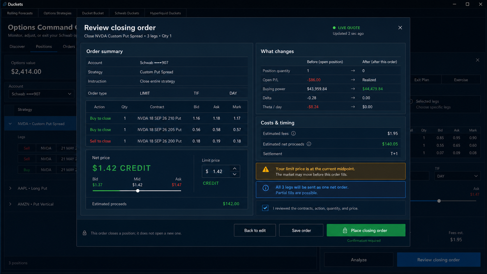

# Duckets options position-management concepts

These concepts turn **Options Strategies** into the lifecycle home for an option position: discover it, monitor it, adjust it, and safely exit it.

## Recommended product structure

Use one secondary navigation inside **Options Strategies**:

1. **Discover** — the current strategy rankings.
2. **Positions** — grouped held strategies with contextual actions.
3. **Orders** — working, filled, canceled, and rejected option orders.
4. **Templates** — reusable exit-plan and order presets.

The recommended flow is:

`Position → Close / Roll / Exit Plan / Exercise → Analyze → Review → Place`

Keep positions and orders conceptually separate. A position can be closed, rolled, or exercised; a working order can be canceled or replaced.

## Concept A — Options Command Center

This is the new default **Positions** view. It groups exact option legs into a strategy, then opens a contextual management drawer from the selected position. The user never has to reconstruct a closing order from a blank ticket.

Key decisions:

- **Close**, **Roll**, **Exit Plan**, and **Exercise** are position actions.
- **Entire strategy** is the safe default; **Selected legs** is explicit.
- A closing ticket reverses the held legs automatically.
- **Analyze** and **Review closing order** precede placement.
- Account impact is visible before leaving the workspace.

## Concept B — Roll workspace

Rolling is treated as a compound task: close the current legs, define replacement legs, then compare the position before and after.

Key decisions:

- Closing and replacement legs are visually separated.
- **Keep strike widths** makes common rolls fast without hiding the exact contracts.
- The order is priced as one net debit or credit.
- Payoff, Greeks, buying power, realized P/L, days extended, and fees are compared before review.
- There is no direct send action from the builder.

## Concept C — Exit-plan builder

This adapts the useful Active Trader bracket idea to an existing multi-leg option strategy. The plan can close the entire strategy as one net order rather than treating each contract independently.

Key decisions:

- The OCO relationship is visible in both the editor and the sequence preview.
- Templates include **Target + stop**, **Single target**, **2 targets**, and **Trailing stop**.
- Quantities stay synchronized across linked exits.
- **Close now…** and **Cancel working orders** exist as secondary, confirmed actions.
- Stop-limit fill risk is explained at configuration time.

## Concept D — Universal order review

Every Close, Roll, Exercise, or Exit Plan route should end in a consistent review surface.

The review must show:

- account, instruction, exact contracts, actions, quantities, and live-quote age;
- limit price relative to bid, midpoint, and ask;
- resulting position quantity, realized P/L, buying power, Delta, and Theta;
- estimated fees, proceeds or cost, settlement, and fill warnings;
- an explicit acknowledgment before the final placement action.

## Feature priority

### P0 — safe exit capability

- Strategy-grouped option positions.
- Close entire strategy or selected legs.
- Cancel and replace working orders.
- Exact-leg review with fees and buying-power effect.
- Clear order lifecycle states and error recovery.

### P1 — active management

- Roll entire strategy or selected legs.
- Before/after payoff and Greeks.
- Target + stop OCO exit plans.
- Reusable templates.
- Exercise for eligible long legs with its own assignment/settlement review.

### P2 — advanced automation

- Multiple profit targets.
- Trailing stops.
- Time-, underlying-price-, and P/L-based conditions.
- Saved advanced-order presets.

Validate each advanced order shape against the broker's current API schema before enabling it. The UI should degrade cleanly when a trigger or linkage is unsupported.

## Naming and safety rules

- Prefer **Close entire strategy** over the trader shorthand **Flatten**.
- Reserve **Cancel** for working orders; it does not remove a held position.
- Do not expose **Reverse** in the initial release. It combines closing risk with opening new risk and deserves a separate, explicit workflow if added later.
- Keep auto-send off by default.
- Use green/red for financial meaning, not as the only indication of an action's state.
- Require a fresh quote and reconfirmation when price or position quantity changes during review.

## Visual prompt set

All four images were generated as high-fidelity, buildable 16:9 desktop UI concepts. The current Duckets screenshots were the visual-system references; the Thinkorswim screenshots were functional references only. Shared constraints were: retain Duckets' dark navy density and top navigation, use readable aligned trading data, avoid copying Thinkorswim branding or exact styling, avoid one-click destructive actions, and show no browser chrome, watermark, glassmorphism, or decorative concept-art effects.

- **A:** Options Command Center with grouped positions and a contextual Close drawer.
- **B:** Roll builder with current/replacement legs, net credit pricing, and before/after payoff analysis.
- **C:** Bracket/OCO exit-plan builder for an entire multi-leg strategy, with templates and safeguards.
- **D:** Universal closing-order review with exact legs, market range, account impact, warnings, and confirmation.

## Implementation workloads

The sequenced implementation plan and copy-ready prompt for each ChatGPT Work task are in [CHATGPT_WORK_PLAN.md](CHATGPT_WORK_PLAN.md). The first release checkpoint is P0 after workload 08; Roll, linked exit plans, and Exercise remain isolated follow-on milestones.

## Implemented capability contract

The current application keeps every concept control visible, but only enables a broker action when its exact order shape and revalidation path are verified. This is the release contract for the native Tkinter implementation:

| Surface | Available now | Explicit capability boundary |
| --- | --- | --- |
| Command Center | Exact option positions, filters, expansion, leg selection, Close, closing-order analysis/review, Roll and Exit Plan builders, Exercise analysis, Orders, and Templates | Strategy grouping is shown but disabled because Schwab position rows do not provide trustworthy strategy linkage. Exercise is analysis-only until exercise submission semantics are verified. |
| Roll | Current and replacement legs, live-chain expiration/strike choices, net pricing, payoff/Greeks comparison, templates, Analyze, and universal Review | Review-only. Atomic multi-leg close/open submission is not enabled without verified broker semantics; the UI does not silently degrade to leg-by-leg orders. |
| Exit Plan | Target + stop, Single target, 2 targets, and Trailing stop templates; exact coverage; OCO preview; target-price resolution; conflict detection; safe template persistence; Close now and working-order routing | A verified Single target can proceed through universal Review and placement. Linked OCO, two-target, and trailing orders stay visible but unavailable because their broker linkage/trigger schemas are not verified. |
| Universal Review | Close and Single-target Exit placement; exact contracts; editable Close limit; bid/mid/ask context; quote aging; preview/fallback states; final position/account/order revalidation; acknowledgment; exactly-once guard | Roll, linked Exit Plan, and Exercise end in review/analysis only. Routine provenance and midpoint context are displayed in their relevant sections, while the notice rail is reserved for actionable execution risk. |

### Intentional visual deviations

- A **Templates** tab is included because it is part of the product structure but absent from the Concept A canvas. It separates reusable, non-sensitive configuration from live positions and orders.
- **Group legs by strategy** remains visible and disabled with a reason instead of inventing position relationships from similar symbols or expirations.
- The review footer uses **Close only** and an ordinary action label rather than a repeated `LOCK` prefix. Safety comes from exact-contract revalidation, acknowledgment, and exactly-once submission—not alarm copy.
- Routine midpoint and data-provenance explanations stay beside the price and cost fields. The notice rail is titled **Execution notes** or **Action required** and contains only information that can affect execution.
- Single-value controls are rendered as read-only facts. Dropdowns are reserved for real choices, including both Day and GTC on the verified single-target exit.

### Offline visual fixture

Run `pythonw tests/visual_option_management_fixture.py` from the repository root to inspect Concept A with deterministic fake account data. Optional `roll`, `exit`, and `review` arguments open Concepts B, C, and D directly; `analyze`, `exercise`, and `templates` expose the connected supporting surfaces. Capture flags can select the single-target state, acknowledgment, compact-size scrolling, and a failed convenience refresh with retained reviewed data. The fixture has no credentials or network code, and its fake session rejects submission unconditionally.
