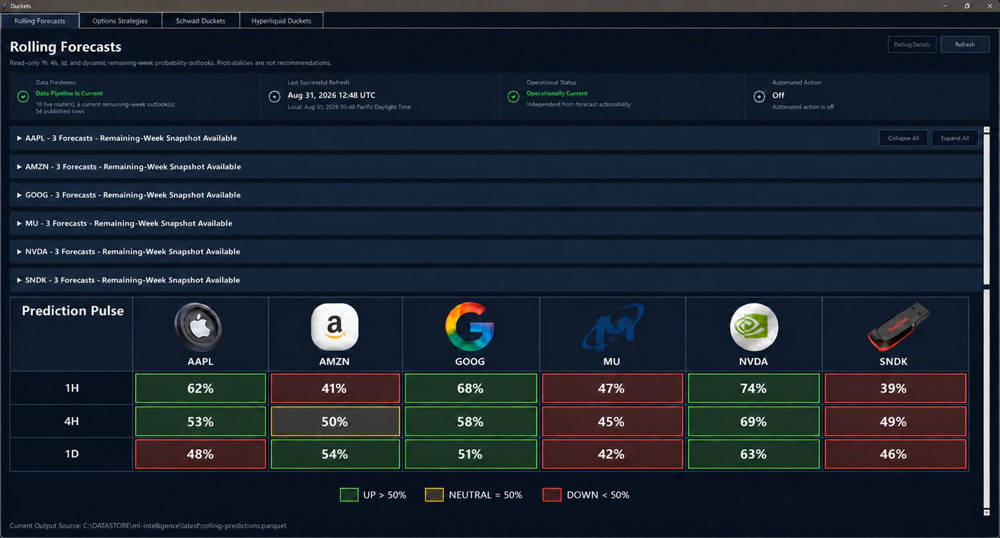
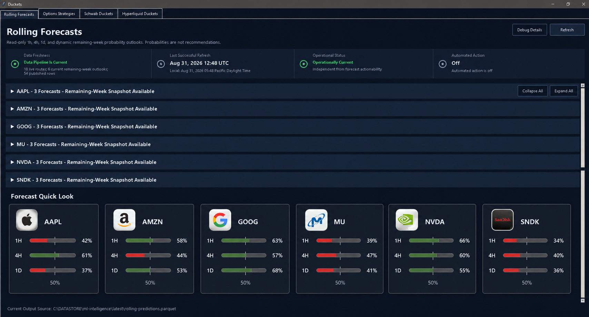
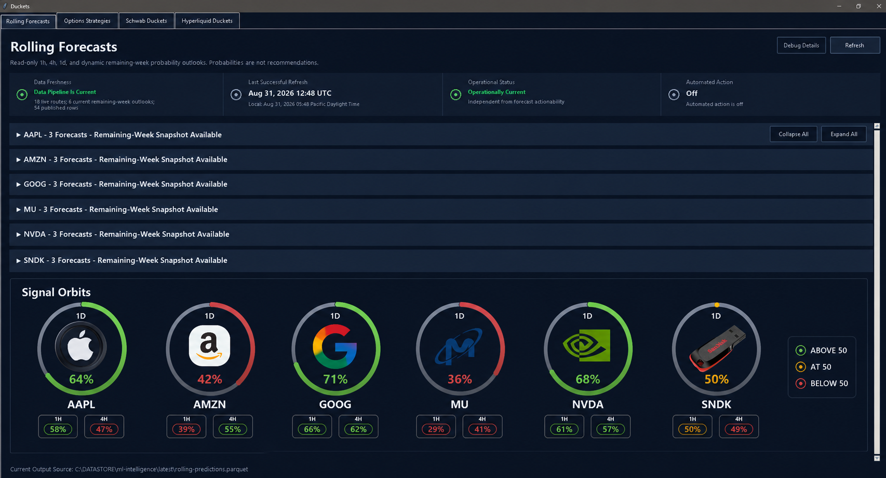

# Rolling Forecasts quick-look concepts

These are design concepts only. No Rolling Forecasts runtime or UI behavior has
been implemented from them yet. The displayed percentages are representative
mock data, not predictions or recommendations.

All three concepts use the same strict visual rule:

- above 50%: green;
- below 50%: red;
- exactly 50%: neutral gray with an amber accent.

## Concept A — Prediction Pulse matrix

Closest to the original markup. Symbols form columns and 1H, 4H, and 1D form
rows, making cross-symbol and cross-horizon comparison immediate. This is the
most information-dense option and the simplest to reproduce faithfully with
Tkinter grid widgets.

Prompt: Preserve the Rolling Forecasts command-center layout and add a dark,
six-column signal matrix below the collapsed forecast rows. Use the supplied
logo for each ticker, three horizon rows, readable percentages, restrained
threshold colors, and a compact legend. Remove the Ducket Bucket navigation tab.

## Concept B — Forecast Quick Look cards

Each symbol gets a self-contained card with its logo and three threshold bands.
This provides the strongest per-company grouping and can wrap responsively at
smaller window widths, though comparing one horizon across every company takes
slightly more eye movement than the matrix.

Prompt: Preserve the Rolling Forecasts command-center layout and add six compact
company cards below the collapsed forecast rows. Each card uses the supplied
logo, ticker, three labeled probability bands, and a visible 50% midpoint.
Remove the Ducket Bucket navigation tab.

## Concept C — Signal Orbits

The 1D prediction becomes the primary circular signal around each company logo,
with 1H and 4H shown as subordinate pills. This is the most visually distinctive
direction, but it gives 1D more weight and requires more custom drawing than the
other concepts.

Prompt: Preserve the Rolling Forecasts command-center layout and add six compact
logo-centered probability rings below the collapsed forecast rows. Use the 1D
prediction as the ring and add smaller 1H and 4H pills with the same threshold
rules. Remove the Ducket Bucket navigation tab.

## Selection note

Concept A is the strongest fit when the primary job is a fast, equal-weight scan
across symbols and horizons. Concept B is the best alternative when responsive
per-company grouping matters more. Concept C favors visual personality and a
primary 1D signal.
